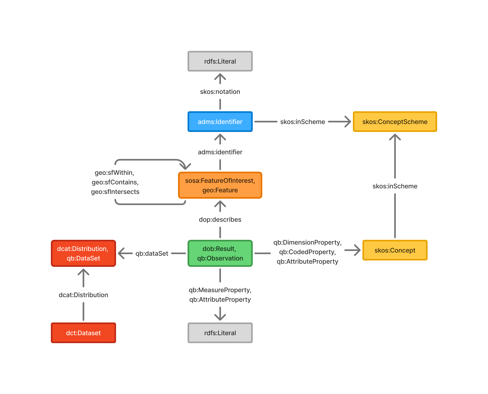
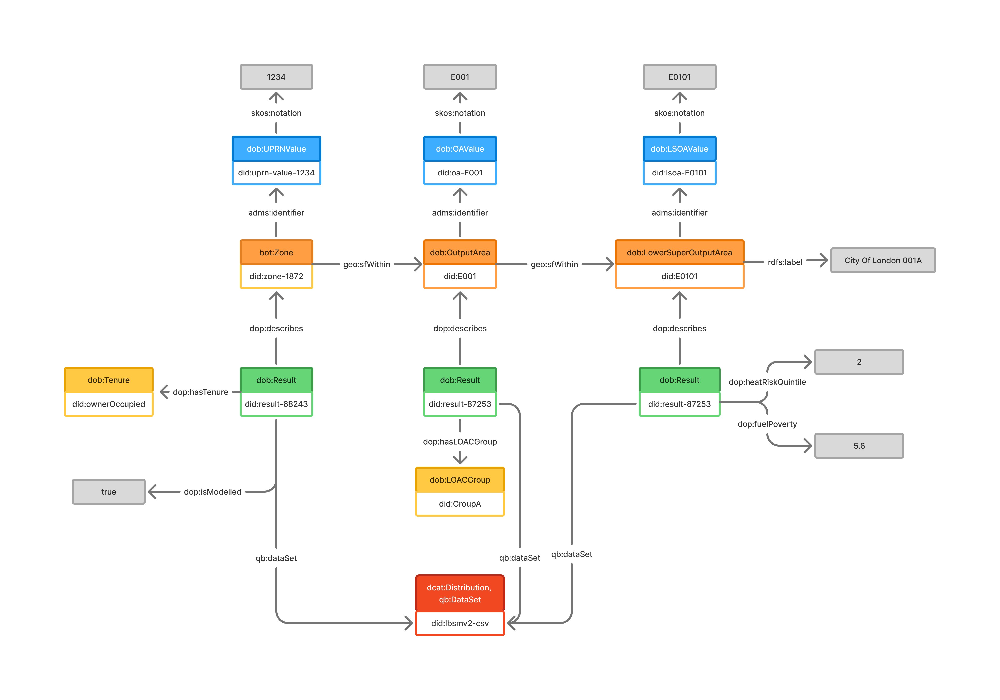
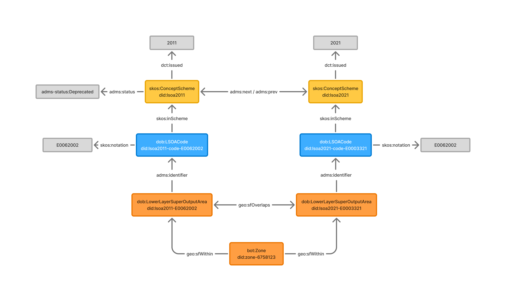

# DOB for LBSM

This document details how the Open Built Environment Data Ontology (DOB) can be applied to the [London Building Stock Model](https://data.london.gov.uk/dataset/london-building-stock-model-2/).

---

## Namespace Prefixes

<div align="center">

| Prefix         | Namespace IRI                                     | Source/Description                                  |
|----------------|---------------------------------------------------|-----------------------------------------------------|
| rdf            | http://www.w3.org/1999/02/22-rdf-syntax-ns#       | RDF Syntax Grammar                                  |
| rdfs           | http://www.w3.org/2000/01/rdf-schema#             | RDF Schema                                          |
| owl            | http://www.w3.org/2002/07/owl#                    | OWL2                                                |
| skos           | http://www.w3.org/2004/02/skos/core#              | SKOS Core Vocabulary                                |
| dob            | https://w3id.org/dob/voc#                         | DOB Ontology vocabulary                             |
| dop            | https://w3id.org/dob/voc/prop#                    | DOB Ontology properties vocabulary                  |
| dob-concept    | https://w3id.org/dob/voc/prop#                    | DOB Ontology concepts vocabulary                    |
| did            | https://w3id.org/dob/id/                          | DOB IDs                                             |
| prov           | http://www.w3.org/ns/prov#                        | W3C PROV Ontology                                   |
| bot            | https://w3id.org/bot#                             | Building Topology Ontology (BOT)                    |
| beo            | http://pi.pauwel.be/voc/buildingelement#          | Building Element Ontology (BEO)                     |
| so             | http://schema.org/                                | Schema.org                                          |
| sosa           | http://www.w3.org/ns/sosa/                        | SOSA/SSN                                            |
| dcat           | http://www.w3.org/ns/dcat#                        | DCAT                                                |
| dct            | http://purl.org/dc/terms/                         | Dublin Core Terms                                   |
| dc             | http://purl.org/dc/elements/1.1/                  | Dublin Core Elements                                |
| adms           | http://www.w3.org/ns/adms#                        | Asset Description Metadata Schema (ADMS)            |
| qudt           | http://qudt.org/schema/qudt#                      | QUDT                                                |
| xsd            | http://www.w3.org/2001/XMLSchema#                 | XML Schema Datatypes                                |
| qb             | http://purl.org/linked-data/cube#                 | The RDF Data Cube Ontology                          |
| geo            | http://www.opengis.net/ont/geosparql#             | GeoSPARQL                                           |
| sdmx-concept   | http://purl.org/linked-data/sdmx/2009/concept#    | SDMX Concepts                                       |
| sdmx-attribute | http://purl.org/linked-data/sdmx/2009/attribute#  | SDMX Attribute properties                           |
| sdmx-dimension | http://purl.org/linked-data/sdmx/2009/dimension   | SDMX Dimension properties                           |

</div>

---

## Core Structure

DOB describes an observation from the dataset with `dob:Result` and the `sosa:FeatureOfInterest` that the result pertains to. A `dob:Result` captures an observation, measurement, or derived value and is linked to the feature it describes using the property `dop:describes`.

A `sosa:FeatureOfInterest` may take many forms, depending on the domain context. Common feature types include:

- `bot:Zone`, building or architectural zones
- `beo:BuildingElement`, elements such as walls, doors, and floors
- `geo:Feature`, generic geospatial features
- `dob:OutputArea`, `dob:LowerLayerSuperOutputArea`, `dob:Ward`, `dob:LondonBorough`, `dob:PostcodeUnitArea`, specific geographic and spatial units.

With the LBSM dataset the only feature of interest types are:

- `bot:Zone`: for most properties, e.g. property type, EPC
- `dob:OutputArea`: for LOAC groups and supergroups
- `dob:LowerLayerSuperOutputArea`: for IMD19 deciles, fuel poverty and heat risk

### Overview



An example implementation with the LBSM dataset is



---

## Results

Results are modelled using the `dob:Result` class. Each result is an observation pertaining to the feature of interest, which in the case would usually represent one or a few cells in the reference data. These results are typically statistical in nature and are described using a set of associated properties, many of which are aligned with the SDMX and [RDF Data Cube Vocabulary (QB)](https://www.w3.org/TR/vocab-data-cube/).

Results are associated with the relevant feature of interest with the `dop:describes` property, and the reference dataset with `qb:dataSet`.

For example,

```turtle
did:zone-0000a75d-eaa9-409a-a588-309f4efe20eb a sosa:FeatureOfInterest, bot:Zone, geo:Feature .

did:result-12345 a dob:Result, qb:Observation ;
    dop:describes did:zone-0000a75d-eaa9-409a-a588-309f4efe20eb ;
    dop:hasPropertyType did:propertyType-flat ;
    dop:isModelled "true"^^xsd:boolean ;
    qb:dataSet did:lbsmv2-csv .
```

### Properties

Where appropriate, existing ontologies are used for property definition. Otherwise, custom properties are defined in the DOP namespace. These properties are typically members of the relevant [Data Cube (QB)](https://www.w3.org/TR/vocab-data-cube/) property types:

- `qb:MeasureProperty`, for quantitative results (e.g., population count)
- `qb:DimensionProperty`, for dimensions along which results vary (e.g., time, location, age group, as well as classifications such as building element types)
- `qb:AttributeProperty`, for metadata or qualifiers (e.g., units, data quality)
- `qb:CodedProperty`, for properties associated with a codelist

DOP properties may use `qb:codeList` to refer to the classification scheme or codelist associated with the property.

The following example illustrates an attribute property, dimension property and measure property.

```turtle
dop:isModelled a rdf:Property , owl:DatatypeProperty , qb:AttributeProperty ;
    rdfs:label "Is Modelled"@en ;
    rdfs:comment "A property that qualifies whether a Result is modelled or known. The range is expected to be Boolean, where 1 signifies that the data is modelled, and 0 signifies that the data is known (i.e., it has been measured directly)."@en ;
    rdfs:subPropertyOf sdmx-attribute:obsStatus ;
    rdfs:seeAlso so:measurementQualifier ;
    qb:concept sdmx-concept:obsStatus ;
    so:domainIncludes sosa:Result , dob:Result , qb:Observation ;
    so:rangeIncludes xsd:Boolean .

dop:hasPropertyType a rdf:Property, owl:ObjectProperty , qb:DimensionProperty , qb:CodedProperty ;
    rdfs:label "Has Property Type"@en ;
    rdfs:subPropertyOf dop:hasAccommodationType ;
    rdfs:seeAlso so:accommodationCategory ;
    rdfs:comment "The property type for dwellings. Together with the Build Form field, Property Type produces a structured description of the property."@en ;
    qb:codeList did:propertyType ;
    qb:concept dob-concept:accommodationType ;
    so:domainIncludes dob:Result , qb:Observation ;
    so:rangeIncludes did:PropertyType .

dop:hasEPCScore a rdf:Property, owl:DatatypeProperty , qb:MeasureProperty ;
    rdfs:label "EPC Score"@en ;
    rdfs:seeAlso so:hasEnergyEfficiencyCategory ;
    rdfs:comment "A numerical representation of the energy efficiency of a building, based on cost of energy, i.e. energy required for space heating, water heating and lighting [in kWh/year] multiplied by fuel costs. (£/m²/year where cost is derived from kWh)."@en ;
    rdfs:seeAlso <https://epc.opendatacommunities.org/> ;
    qb:concept dob-concept:energyEfficiencyEnumeration ;
    so:domainIncludes dob:Result , qb:Observation ;
    so:rangeIncludes xsd:int .
```

For the LBSM dataset the following properties have been developed and used:

* `dop:isModelled`: A property that qualifies whether a Result is modelled or known. The range is expected to be Boolean, where 1 signifies that the data is modelled, and 0 signifies that the data is known (i.e., it has been measured directly)
* `dop:bngEasting`: The eastward-measured Cartesian coordinate of a point in the British National Grid.
* `dop:bngNorthing`: The northward-measured Cartesian coordinate of a point in the British National Grid.
* `dop:hasPropertyType`: The property type for dwellings. Together with the Build Form field, Property Type produces a structured description of the property.
* `dop:hasBuiltForm`: The building built form. Together with the Property Type field, the Build Form produces a structured description of the property.
* `dop:hasAccommodationType`: The combined property type and built form for dwellings.
* `dop:hasTenure`: The legal or financial arrangement under which a building or dwelling is occupied.
* `dop:isModelled`: A property that qualifies whether a Result is modelled or known. The range is expected to be Boolean, where 1 signifies that the data is modelled, and 0 signifies that the data is known (i.e., it has been measured directly).
* `dop:bngEasting`: The eastward-measured Cartesian coordinate of a point in the British National Grid.
* `dop:bngNorthing`: The northward-measured Cartesian coordinate of a point in the British National Grid.
* `dop:hasPropertyType`: The property type for dwellings. Together with the Build Form field, Property Type produces a structured description of the property.
* `dop:hasBuiltForm`: The building built form. Together with the Property Type field, the Build Form produces a structured description of the property.
* `dop:hasAccommodationType`: The combined property type and built form for dwellings.
* `dop:hasTenure`: The legal or financial arrangement under which a building or dwelling is occupied.
* `dop:hasBuildingUse`: Describes the primary function or usage category of a building.
* `dop:constructionAgeBand`: Age band when the feature was constructed.
* `dop:hasEPCScore`: A numerical representation of the energy efficiency of a building, based on cost of energy, i.e., energy required for space heating, water heating and lighting \[in kWh/year] multiplied by fuel costs. (£/m²/year where cost is derived from kWh).
* `dop:hasEPCRating`: Current energy rating converted into a linear 'A to G' rating (where A is the most energy efficient and G is the least energy efficient).
* `dop:hasPotentialEPCScore`: The potential EPC Score.
* `dop:hasPotentialEPCRating`: The potential EPC Rating.
* `dop:numberOfHabitableRooms`: Habitable rooms include any living room, sitting room, dining room, bedroom, study and similar; and also a non-separated conservatory. A kitchen/diner having a discrete seating area (with space for a table and four chairs) also counts as a habitable room. A non-separated conservatory adds to the habitable room count if it has an internal quality door between it and the dwelling. Excluded from the room count are any room used solely as a kitchen, utility room, bathroom, cloakroom, en-suite accommodation and similar and any hallway, stairs or landing; and also any room not having a window.
* `dop:totalFloorArea`: The total useful floor area is the total of all enclosed spaces measured to the internal face of the external walls, i.e. the gross floor area as measured in accordance with the guidance issued from time to time by the Royal Institute of Chartered Surveyors or by a body replacing that institution. (m²)
* `dop:floorCount`: The estimated number of storeys in a building, inferred from total building height and an assumed floor-to-floor height.
* `dop:basementFloorCount`: Indicates the presence and number of known basement floors in the building.
* `dop:hasWallType`: The property's wall construction type.
* `dop:hasWallInsulation`: Denotes whether the property's walls are insulated.
* `dop:hasRoofType`: The property's roof type.
* `dop:hasRoofInsulation`: Denotes whether the property's roof is insulated.
* `dop:hasGlazingType`: The property's glazing type.
* `dop:hasMainHeatingSystem`: The property's main heating system.
* `dop:hasMainFuelType`: The primary fuel used to heat the property.
* `dop:energyConsumption`: Current estimated total energy demand for the property in a 12 month period.
* `dop:solarPVArea`: The estimated area of the building's roof surface where the annual potential is greater than 700kWh per metre square and the slope is less than 65°.
* `dop:solarPVPotential`: The estimated annual solar PV output in kWh for the building's viable roof area based on an assumed efficiency of 11.9%.
* `dop:averageRoofTilt`: The average tilt of the building's roof.
* `dop:imd19NationalDecile`: The LSOA’s decile (out of all LSOAs in England) based on the 2019 Index of Multiple Deprivation (IMD) score.
* `dop:imd19IncomeDecile`: The LSOA’s decile (out of all LSOAs in England) based on the 2019 Index of Multiple Deprivation (IMD) income deprivation domain.
* `dop:loacSupergroup`: The 2021 London Output Area Classification (LOAC) supergroup.
* `dop:loacGroup`: The 2021 London Output Area Classification (LOAC) group.
* `dop:fuelPoverty`: The proportion of households within the LSOA that are in fuel poverty. Based on 2024 sub-regional data from DESNZ.
* `dop:heatRiskQuintile`: The heat risk for residential properties in the wake of climate change. The risk is split into quintiles and is based on the 'Properties Vulnerable to Heat Impact' report produced by Arup for the GLA.
* `dop:listedBuildingGrade`: Listed building grade for properties that could be linked to their Historic England records.
* `dop:inConservationArea`: Denotes whether the property is in a conservation area.
* `dop:conservationSiteID`: Unique ID for the conservation area which can be used to identify properties in the same conservation area. This ID is specific to the London Building Stock Model.

---

## Classifications

The section describes classification and codelists.

Classification schemes are modelled as `skos:ConceptScheme` instances, with their concepts modeled as `skos:Concept`. Hierarchical relations between concepts are represented using:

- `skos:broader`, for broader concepts
- `skos:narrower`, for more specific concepts

Each classification concept may be linked to its usage context (e.g., a specific measure or dimension) via `qb:codeList`.

The following example classifies listed building grades in the UK.

```turtle
did:listedBuildingGrade a skos:ConceptScheme ;
    dct:title "Listed Building Grades" ;
    dct:description "Listed buildings are buildings of special architectural or historic interest with legal protection. The Historic Buildings and Monuments Commission in England and Cadw in Wales list buildings under three grades, with Grade I being the highest grade." ;
    dct:publisher <https://historicengland.org.uk/> ;
    dc:publisher "Historic England" ;
    dct:source <https://opendata-historicengland.hub.arcgis.com/> ;
    dct:license <http://www.nationalarchives.gov.uk/doc/open-government-licence/version/3/> ;
    rdfs:seeAlso dob:ListedBuildingGrade ;
    rdfs:seeAlso <https://historicengland.org.uk/listing/what-is-designation/listed-buildings/> ;
    skos:hasTopConcept did:listedBuildingGrade-I ;
    skos:hasTopConcept did:listedBuildingGrade-II ;
    skos:hasTopConcept did:listedBuildingGrade-IIStar ;
    skos:hasTopConcept did:listedBuildingGrade-Unknown .

dob:ListedBuildingGrade a rdfs:Class, owl:Class ;
    rdfs:label "Listed Building Grade" ;
    rdfs:subClassOf skos:Concept ;
    rdfs:seeAlso did:listedBuildingGrade .

did:listedBuildingGrade-I a skos:Concept, dob:ListedBuildingGrade ;
    skos:topConceptOf did:listedBuildingGrade ;
    skos:prefLabel "Grade I"@en ;
    skos:note "Buildings of exceptional interest." ;
    skos:notation "I" ;
    skos:inScheme did:listedBuildingGrade .

did:listedBuildingGrade-II a skos:Concept, dob:ListedBuildingGrade ;
    skos:topConceptOf did:listedBuildingGrade ;
    skos:prefLabel "Grade II"@en ;
    skos:note "Buildings of special interest." ;
    skos:notation "II" ;
    skos:inScheme did:listedBuildingGrade .

did:listedBuildingGrade-IIStar a skos:Concept, dob:ListedBuildingGrade ;
    skos:topConceptOf did:listedBuildingGrade ;
    skos:prefLabel "Grade II*"@en ;
    skos:note "Buildings of more than special interest." ;
    skos:notation "II*" ;
    skos:inScheme did:listedBuildingGrade .

did:listedBuildingGrade-Unknown a skos:Concept, dob:ListedBuildingGrade ;
    skos:topConceptOf did:listedBuildingGrade ;
    skos:prefLabel "Unknown Grade"@en ;
    skos:notation "Unknown" ;
    skos:inScheme did:listedBuildingGrade .
```

The following properties have classification schemes:

* `property-type`: flat, house, park-home-caravan
* `built-form`: detached, semi-detached, end-terrace, mid-terrace
* `accommodation-type`: flat, semi-detached-house, detached-house, end-terraced-house, mid-terraced-house, park-home-caravan
* `tenure`: owner-occupied, social-housing, privately-rented
* `epc-rating`: AB, C, D, E, FG
* `potential-epc-rating`: AB, C, D, E, FG
* `construction-age-band`: pre-1900, 1900-1929, 1930-1949, 1950-1966, 1967-1982, 1983-1995, 1996-2011, 2012-onwards
* `building-use`: residential-only, mixed-use
* `main-heating-system`: boiler, room-storage-heaters, heat-pump, communal, none, other
* `main-fuel-type`: mains-gas, electricity, no-heating-system, other
* `wall-type`: cavity, solid, other
* `roof-type`: pitched, flat, room-in-roof, another-dwelling-above
* `glazing-type`: single-partial, secondary, double-triple
* `loac-supergroup`: A, B, C, D, E, F, G
* `loac-group`: A1, A2, A3, B1, B2, C1, C2, D1, D2, D3, E1, E2, F1, F2, G1, G2
* `listed-building-grade`: I, II, IIStar, Unknown

---

## Geospatial data

While knowledge graphs are not well suited to complex geospatial modelling, we  include basic spatial descriptions to support integration with location-based datasets and support basic geospatial reasoning.

### Coordinates

For coordinate-level data, we use

- `wgs84:lat`, latitude
- `wgs84:long`, longitude
- `dop:bngEasting`, a custom property for projected easting in the British National Grid
- `dop:bngNorthing`, a custom property for projected northing in the British National Grid

For example,

```turtle
did:zone-0000a75d-eaa9-409a-a588-309f4efe20eb a sosa:FeatureOfInterest, bot:Zone, geo:Feature .

did:result-123456 a dob:Result, qb:Observation ;
    dop:describes did:zone-0000a75d-eaa9-409a-a588-309f4efe20eb ;
    qb:dataSet did:lbsmv2-csv ;
    dop:bngEasting "532271"^^xsd:int ;
    dop:bngNorthing "181868"^^xsd:int .
```

### Topological Relationships

Basic topological relation are described with the GeoSPARQL Simple Features properties, which are defined in [section 9.2 of the GeoSPARQL documentation](https://docs.ogc.org/is/22-047r1/22-047r1.html). These include `geo:sfIntersects`, `geo:sfWithin`, and `geo:sfContains`. 

---

## Identifiers

Identifiers are strings that are intended to uniquely identify some feature of interest, process or event. 

The `adms:Identifier` class is used to describe identifiers. The property `adms:identifier` links the resource to the identifier, and `skos:notation` gives the value of the identifier.

Identifiers may belong to external controlled vocabularies or classification schemes (e.g., Unique Property Reference Numbers (UPRNs), LSOA codes, administrative identifiers). When this is the case, the identifier concept is linked to a `skos:ConceptScheme` that defines its scope and semantics.

Identifiers are implemented as in the following diagram.



---

## Dataset Metadata

Metadata for datasets, including provenance, licensing, update frequency, and distribution details, may be described using the [DCAT vocabulary](https://www.w3.org/TR/vocab-dcat-3/).

Dataset metadata is not implemented within the Ontop mapping. 