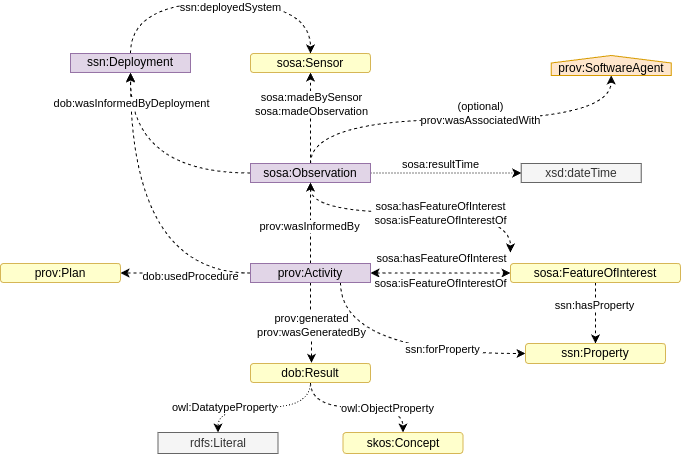

[back to readme](../README.adoc)

# Open Built Environment Data Ontology (DOB)

This document describes the DOB ontology, designed for representing, integrating, and publishing built environment data using Linked Data and Semantic Web standards. The ontology leverages W3C PROV-O for provenance, SOSA/SSN for sensor and observation modeling, and aligns with established vocabularies such as Schema.org, DCAT, and BOT.

## Namespace Prefixes

| Prefix | Namespace IIR                                 | Source/Description                                              |
|--------|-----------------------------------------------|-----------------------------------------------------------------|
| rdf    | http://www.w3.org/1999/02/22-rdf-syntax-ns#   | RDF Syntax Grammar                                              |
| rdfs   | http://www.w3.org/2000/01/rdf-schema#         | RDF Schema                                                      |
| owl    | http://www.w3.org/2002/07/owl#                | OWL2                                                            |
| skos   | http://www.w3.org/2004/02/skos/core#          | SKOS                                                            |
| dob    | https://w3id.org/dob/voc#                     | DOB Ontology vocabulary                                         |
| dop    | https://w3id.org/dob/voc/prop#                | DOB Ontology properties vocabulary                              |
| did    | https://w3id.org/dob/id/                      | DOB IDs                                                         |
| bng    | https://w3id.org/dob/voc/epsg-27700#          | British National Grid (BNG) coordinates                         |
| prov   | http://www.w3.org/ns/prov#                    | W3C PROV-O                                                      |
| bot    | https://w3id.org/bot#                         | Building Topology Ontology (BOT)                                |
| beo    | http://pi.pauwel.be/voc/buildingelement#      | Building Element Ontology (BEO)                                 |
| so     | http://schema.org/                            | Schema.org                                                      |
| sosa   | http://www.w3.org/ns/sosa/                    | SOSA/SSN                                                        |
| ssn    | http://www.w3.org/ns/ssn/                     | SSN                                                             |
| dcat   | http://www.w3.org/ns/dcat#                    | DCAT                                                            |
| dct    | http://purl.org/dc/terms/                     | Dublin Core Terms                                               |
| qudt   | http://qudt.org/schema/qudt#                  | QUDT                                                            |
| xsd    | http://www.w3.org/2001/XMLSchema#             | XML Schema Datatypes                                            |
| wgs84  | http://www.w3.org/2003/01/geo/wgs84_pos#      | WGS84 Geo                                                       |

---

## Overview

<div align="center">
    
</div>

DOB provides a flexible, provenance-aware framework for representing built environment data, including sensor observations, derived results, software pipelines, and external datasets. It is based on:

- **PROV-O**: Provenance of entities, activities, and agents.
- **SOSA/SSN**: Observations, sensors, and features of interest.
- **Schema.org**: Property values, software, and data objects.
- **BOT/BEO**: Building topology and elements.
- **DCAT**: Dataset and distribution metadata.

---

## Core Classes

| Class                | Subclass Of                                 | Restrictions / Notes                                                                 | Description                                                                                                    |
|----------------------|---------------------------------------------|--------------------------------------------------------------------------------------|----------------------------------------------------------------------------------------------------------------|
| **dob:PropertyValue** | `prov:Entity`, `so:PropertyValue`           |                                                                                        | A property name and value pair describing an entity attribute. Subclasses specialize identifier types.         |
| **dob:UPRNValue**    | `dob:PropertyValue`                         | `so:propertyID` = `"UPRN"`                                                            | Unique numeric identifier for a spatial addressable location in Great Britain (Ordnance Survey).               |
| **dob:ODSValue**     | `dob:PropertyValue`                         | `so:propertyID` = `"ODS"`                                                             | NHS Digital identifier for health/social care organisations.                                                   |
| **dob:OAValue**      | `dob:PropertyValue`                         | `so:propertyID` = `"OA"`                                                              | ONS Output Area identifier for statistical geography.                                                          |
| **dob:Enumeration**  | `prov:Entity`, `so:Enumeration`             |                                                                                        | Discrete values/categories for classifying sosa:Result.                                                        |
| **dob:Processing**   | `prov:Activity`                             |                                                                                        | Software-based processing workflow that generates or transforms data.                                          |
| **dob:CodeRepository** | `prov:Entity`, `so:SoftwareSourceCode`     |                                                                                        | Version-controlled source code repository (e.g., Git).                                                         |
| **dob:CodeRevision**   | `prov:Entity`, `so:SoftwareSourceCode`     | `dob:tagURI` (cardinality = 1)                                                        | Specific, immutable code revision (tag or commit hash).                                                        |
| **dob:OutputArea**     | `prov:Entity`, `so:Place`                  |                                                                                        | Smallest UK census geography unit (ONS Output Area).                                                           |

---

## Core Properties

| Property                      | Subproperty Of             | Domain Includes         | Range Includes      | Description                                                                                                   |
|-------------------------------|----------------------------|------------------------|---------------------|---------------------------------------------------------------------------------------------------------------|
| **dob:typeQualifier**         | `so:measurementQualifier`  | `sosa:Result`          | `dob:Enumeration`   | Qualifies the type of sosa:Result using a controlled enumeration.                                             |
| **dob:tagURI**                | `so:url`                   | `dob:CodeRevision`      | `xsd:anyURI`        | URI of the specific tagged code revision (e.g., GitHub commit/tag).                                           |
| **dob:recommendationCode**    | `so:valueReference`        | `dob:PropertyValue`     | `xsd:string`        | General-purpose recommendation or confidence code for identifier matching.                                     |
| **dob:recommendationCodeAddress** | `dob:recommendationCode` | `dob:PropertyValue` | `"A"` or `"I"` (`xsd:string`) | Address-to-UPRN match confidence: 'A' (Accept) or 'I' (Intervention required).                                |

### Inverse Properties

- **dob:isTypeQualifierOf**: Inverse of `dob:typeQualifier` (from enumeration to qualified result).
- **dob:isRecommendationForPropertyValue**: Inverse of `dob:recommendationCode`.
- **dob:isAddressRecommendationForPropertyValue**: Inverse of `dob:recommendationCodeAddress`.

---

## Example Usage

### Sensor Observations and Results

<div align="center">
    
</div>

```turtle
# ...existing code...
did:observation-213ff099-403a-50a1-80d4-f0e61ab62c0a a sosa:Observation ;
    sosa:hasFeatureOfInterest did:zone-c7d626e6-20fb-4964-be29-a5382c1ad8fb ;
    sosa:hasResult did:63d55edf-9747-5be9-93a5-aece2658a36a ;
    sosa:madeBySensor did:lidar-122310001278 ;
    sosa:usedProcedure did:api-writer-0669539b-96b5-50b5-90e6-09e548115463,
        did:lidar-procedure-049cf124-1454-53e0-96cb-9a85cd35d5a5 .

did:63d55edf-9747-5be9-93a5-aece2658a36a a so:ImageObject, sosa:Result ;
    rdfs:label "reflectance LiDAR panorama" ;
    so:contentUrl <https://didapi.io/v1/result/63d55edf-9747-5be9-93a5-aece2658a36a.png> ;
    so:encodingFormat "image/png"^^xsd:string ;
    sosa:resultTime "2025-05-08T11:07:20+00:00"^^xsd:dateTime ;
    dob:typeQualifier did:lidar-reflectance-pano .
# ...existing code...
```

### Identifier Example

<div align="center">
    
</div>

```turtle
# ...existing code...
did:zone-0000a75d-eaa9-409a-a588-309f4efe20eb a sosa:FeatureOfInterest, bot:Zone ;
    so:identifier did:ods-value-VNKWK .

did:ods-value-VNKWK a dob:ODSValue ;
    so:propertyID "ODS"^^xsd:string ;
    so:value "VNKWK"^^xsd:string ;
    dob:recommendationCodeAddress "A"^^xsd:string .
# ...existing code...
```

---

## BNG Properties

| Property        | Description                                                                                         |
|-----------------|-----------------------------------------------------------------------------------------------------|
| **bng:easting** | Easting coordinate in EPSG:27700. See [../voc/epsg-27700/index.ttl](../voc/epsg-27700/index.ttl)    |
| **bng:nothing** | Northing coordinate in EPSG:27700. See [../voc/epsg-27700/index.ttl](../voc/epsg-27700/index.ttl)   |

---

## Building Topology

<div align="center">
    
</div>

All zones and elements are instances of `sosa:FeatureOfInterest`. Building topology is described in detail with the [Building Topology Ontology (BOT)](https://w3c-lbd-cg.github.io/bot/) and [Building Element Ontology (BEO)](https://pi.pauwel.be/voc/buildingelement/index-en.html).

---

## Design Notes

- **Provenance**: All data, results, and transformations are linked to their provenance using PROV-O.
- **Identifiers**: Custom identifier classes (UPRN, ODS, OA) enable robust cross-dataset linking.
- **Enumerations**: Use `dob:Enumeration` for controlled vocabularies and result typing.
- **Software & Processing**: Software pipelines and code provenance are modeled using `dob:CodeRepository` and `dob:CodeRevision`.
- **Extensibility**: The ontology is modular and can be extended for new identifier types, result types, or processing activities.

---

## References

#### [BEO]
Building Element Ontology. Pieter Pauwels. 2021. URL: https://pi.pauwel.be/voc/buildingelement/index-en.html

#### [BOT]
BOT Building Topology Ontology. Mads Holten Rasmussen; Pieter Pauwels; Maxime Lefrançois; Georg Ferdinand Schneider. W3C. 28 June 2021. URL: https://w3id.org/bot#

#### [DCAT-AP]
DCAT Application Profile for data portals in Europe. Version 2.0.1. European Commission. 8 June 2020. URL: https://joinup.ec.europa.eu/solution/dcat-application-profile-data-portals-europe 

#### [DCAT-US]
Data Catalog Application Profile for the United States of America. Thomas Dabolt; Michael Ratcliffe; Open Government Data; Stephane Fellah; Sofiane Fellah; John Davidson. Candidate Recommendation Snapshot. 7 March 2024. URL: https://doi-do.github.io/dcat-us/

#### [DCTERMS]
DCMI Metadata Terms. DCMI Usage Board. DCMI. 20 January 2020. DCMI Recommendation. URL: https://www.dublincore.org/specifications/dublin-core/dcmi-terms/ 

#### [DLProv]
Débora Pina, Adriane Chapman, Liliane Kunstmann, Daniel de Oliveira, and Marta Mattoso. 2024. DLProv: A Data-Centric Support for Deep Learning Workflow Analyses. In Proceedings of the Eighth Workshop on Data Management for End-to-End Machine Learning (DEEM '24). Association for Computing Machinery, New York, NY, USA, 77–85. https://doi.org/10.1145/3650203.3663337

#### [IANA-MEDIA-TYPES]
Media Types. IANA. URL: https://www.iana.org/assignments/media-types/ 

#### [MLFlow2PROV]
Marius Schlegel and Kai-Uwe Sattler. 2023. MLflow2PROV: Extracting Provenance from Machine Learning Experiments. In Proceedings of the Seventh Workshop on Data Management for End-to-End Machine Learning (DEEM '23). Association for Computing Machinery, New York, NY, USA, Article 9, 1–4. https://doi.org/10.1145/3595360.3595859

#### [OS]
Ordnance Survey. URL: https://www.ordnancesurvey.co.uk/

#### [ONS Geography Linked Data]
ONS Geography Linked Data. Office for National Statistics. URL: https://statistics.data.gov.uk/home

#### [ONS Open Geography Portal]
ONS Open Geography Portal. Office for National Statistics. URL: https://geoportal.statistics.gov.uk/

#### [Ontology Design Template]
Donkers, A. (2022). Ontology Design Template. https://doi.org/10.5281/zenodo.6816899

#### [OWL2-OVERVIEW]
OWL 2 Web Ontology Language Document Overview (Second Edition). W3C OWL Working Group. W3C. 11 December 2012. W3C Recommendation. URL: https://www.w3.org/TR/owl2-overview/ 

#### [OWL2-SYNTAX]
OWL 2 Web Ontology Language Structural Specification and Functional-Style Syntax (Second Edition). Boris Motik; Peter Patel-Schneider; Bijan Parsia. W3C. 11 December 2012. W3C Recommendation. URL: https://www.w3.org/TR/owl2-syntax/ 

#### [PROV-DC]
Daniel Garijo; Kai Eckert; eds. Dublin Core to PROV Mapping. 30 April 2013, W3C Note. URL : http://www.w3.org/TR/2013/NOTE-prov-dc-20130430/

#### [PROV-DM]
Luc Moreau; Paolo Missier; eds. PROV-DM: The PROV Data Model. 30 April 2013, W3C Recommendation. URL: http://www.w3.org/TR/2013/REC-prov-dm-20130430/

#### [PROV-O]
PROV-O: The PROV Ontology. Timothy Lebo; Satya Sahoo; Deborah McGuinness. W3C. 30 April 2013. W3C Recommendation. URL: https://www.w3.org/TR/prov-o/ 

#### [RDF-SYNTAX-GRAMMAR]
RDF 1.1 XML Syntax. Fabien Gandon; Guus Schreiber. W3C. 25 February 2014. W3C Recommendation. URL: https://www.w3.org/TR/rdf-syntax-grammar/ 

#### [RDF-SCHEMA]
RDF Schema 1.1. Dan Brickley; Ramanathan Guha. W3C. 25 February 2014. W3C Recommendation. URL: https://www.w3.org/TR/rdf-schema/ 

#### [SKOS-REFERENCE]
SKOS Simple Knowledge Organization System Reference. Alistair Miles; Sean Bechhofer. W3C. 18 August 2009. W3C Recommendation. URL: https://www.w3.org/TR/skos-reference/ 

#### [SPARQL]
SPARQL 1.1 Query Language. Steve Harris; Andy Seaborne; Eric Prud'hommeaux. 21 March 2013. W3C Recommendation. URL: https://www.w3.org/TR/sparql11-query/

#### [SSN-PROV]
Sensor Data Provenance: SSNO and PROV-O Together at Last. Michael Compton; David Corsar; Kerry Taylor. CEUR: 7th International Conference on Semantic Sensor Networks. 2014. URL: http://ceur-ws.org/Vol-1401/paper-05.pdf 

#### [Turtle]
RDF 1.1 Turtle. Eric Prud'hommeaux; Gavin Carothers. W3C. 25 February 2014. W3C Recommendation. URL: https://www.w3.org/TR/turtle/ 

#### [UPRN]
Unique Property Reference Number (UPRN). GeoPlace. URL: https://www.geoplace.co.uk/addresses/unique-property-reference-number-uprn

#### [VOCAB-DCAT]
Data Catalog Vocabulary (DCAT). Fadi Maali; John Erickson. W3C. 4 February 2020. W3C Recommendation. URL: https://www.w3.org/TR/vocab-dcat/ 

#### [VOCAB-SSN]
Semantic Sensor Network Ontology. Armin Haller; Krzysztof Janowicz; Simon Cox; Danh Le Phuoc; Kerry Taylor; Maxime Lefrançois. W3C. 19 October 2017. W3C Recommendation. URL: https://www.w3.org/TR/vocab-ssn/ 

#### [W3C-BASIC-GEO]
Basic Geo (WGS84 lat/long) Vocabulary. Dan Brickley. W3C Semantic Web Interest Group. 1 February 2006. URL: https://www.w3.org/2003/01/geo/ 

#### [XML-SCHEMA11-2]
W3C XML Schema Definition Language (XSD) 1.1 Part 2: Datatypes. David Peterson; Sandy Gao; Ashok Malhotra; Michael Sperberg-McQueen; Henry Thompson; Paul V. Biron et al. W3C. 5 April 2012. W3C Recommendation. URL: https://www.w3.org/TR/xmlschema11-2/ 

#### [QUDT]
QUDT - Quantities, Units, Dimensions and Data Types Ontologies. Ralph Hodgson; Paul J. Keller; Jack Hodges; Jack Spivak.18 March 2014. URL: http://www.qudt.org/
