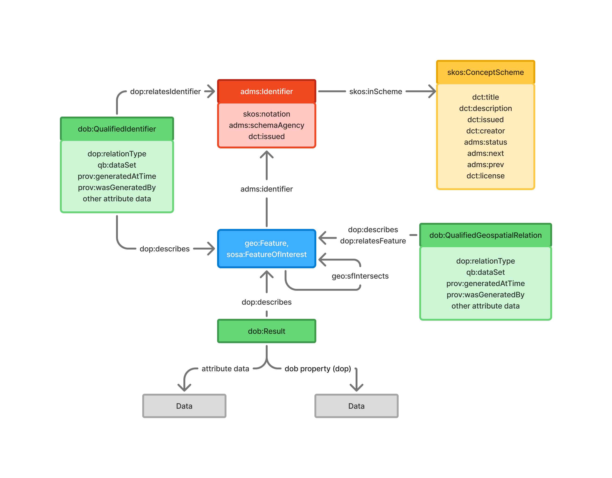
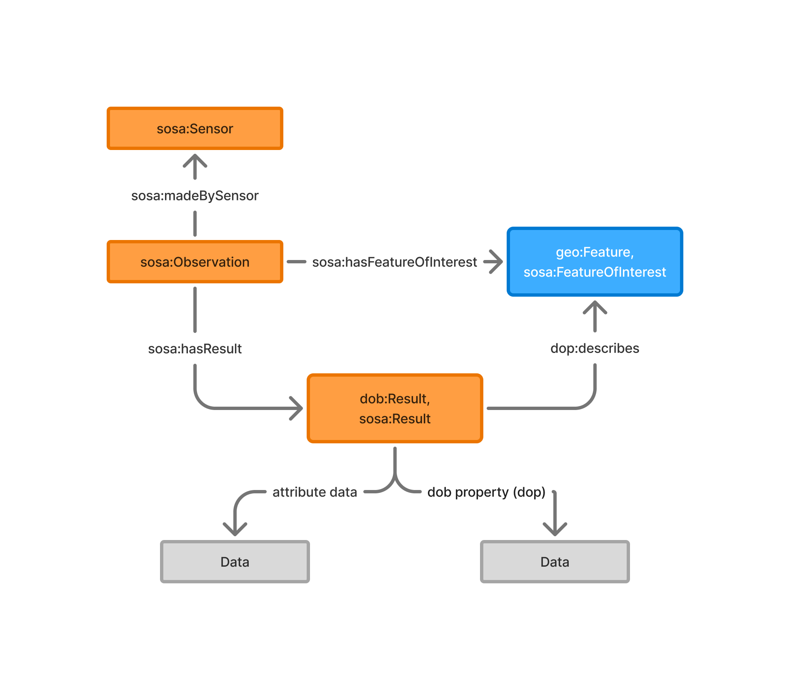
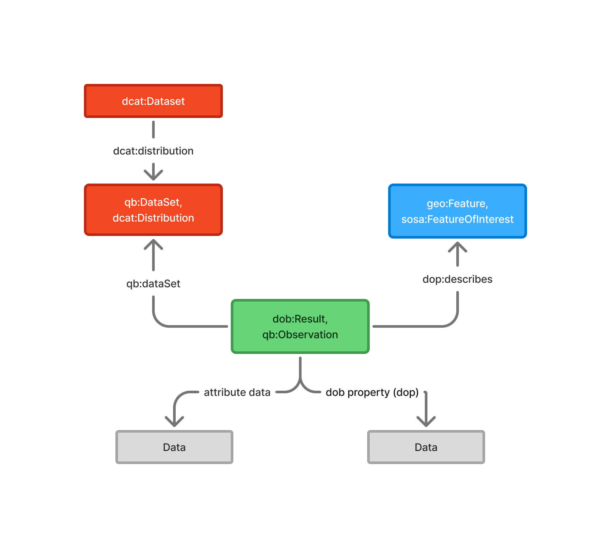
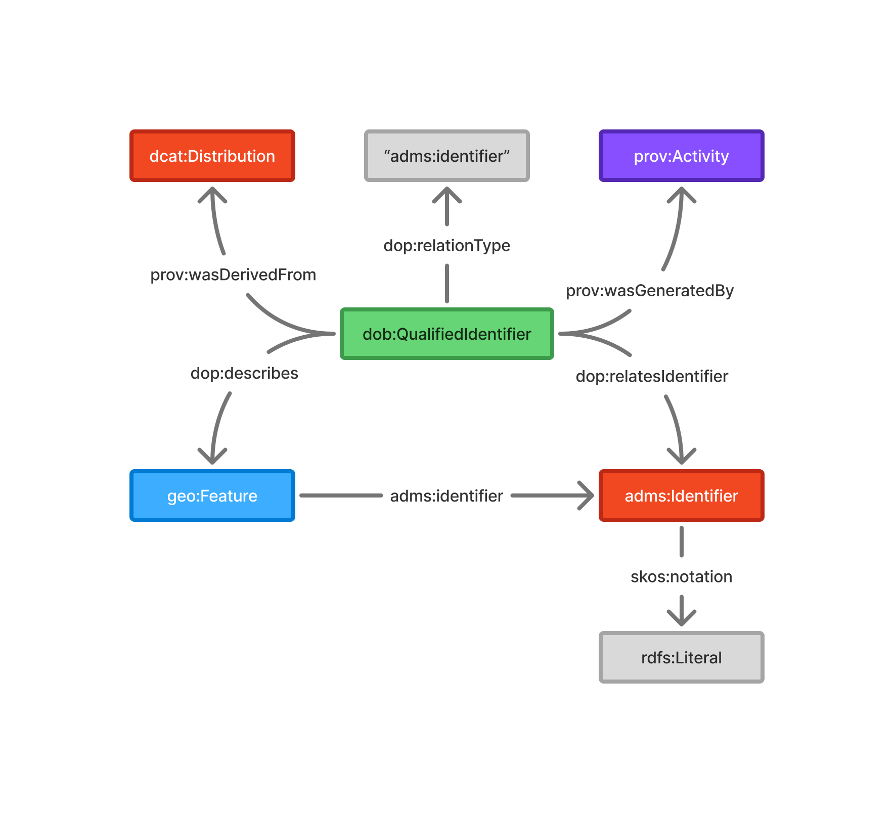
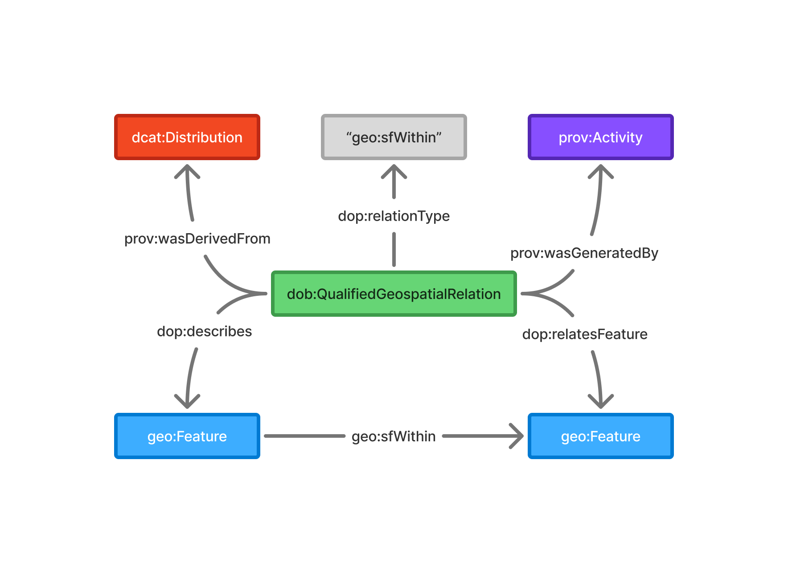
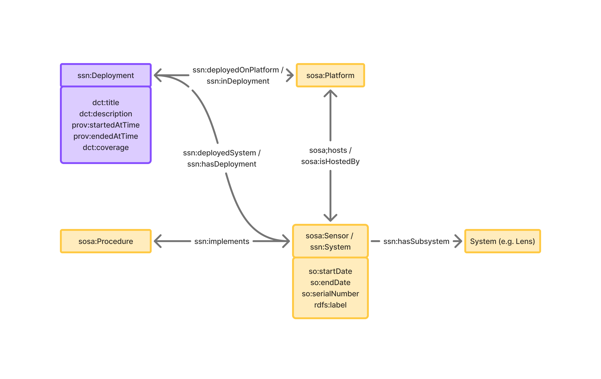

# Open Built Environment Data Ontology (DOB)

The DOB ontology provides a semantic framework for representing, integrating, and publishing data about the built environment. It is designed to support interoperability, provenance tracking, and data integration across diverse sources such as sensor networks, external datasets, and software pipelines. The ontology builds on established standards including W3C PROV-O for provenance, SOSA/SSN for sensor and observation modeling, Schema.org for general data modeling, DCAT for dataset metadata, and BOT/BEO for building topology and elements.

---

## Namespace Prefixes

The namespaces and suggested prefixes for the DOB ontology are

<div align="center">

| Prefix      | Namespace IRI                              |Description                                                    |
|-------------|--------------------------------------------|---------------------------------------------------------------|
| dob         | https://w3id.org/dob/voc#                  | DOB Ontology vocabulary                                       |
| dop         | https://w3id.org/dob/voc/prop#             | DOB Ontology properties vocabulary                            |
| did         | https://w3id.org/dob/id/                   | DOB IDs                                                       |

</div>

The namespaces used in this document are described below.

<div align="center">

| Prefix         | Namespace IRI                                     | Source/Description                                  |
|----------------|---------------------------------------------------|-----------------------------------------------------|
| rdf            | http://www.w3.org/1999/02/22-rdf-syntax-ns#       | [RDF Syntax Grammar](#rdf-syntax-grammar)                                  |
| rdfs           | http://www.w3.org/2000/01/rdf-schema#             | [RDF Schema](#rdf-schema)                                          |
| owl            | http://www.w3.org/2002/07/owl#                    | [OWL2](#owl2-syntax)                                                |
| skos           | http://www.w3.org/2004/02/skos/core#              | [SKOS Core Vocabulary](#skos-reference)                                |
| dob            | https://w3id.org/dob/voc#                         | DOB Ontology vocabulary                             |
| dop            | https://w3id.org/dob/voc/prop#                    | DOB Ontology properties vocabulary                  |
| did            | https://w3id.org/dob/id/                          | DOB IDs                                             |
| prov           | http://www.w3.org/ns/prov#                        | [W3C PROV Ontology](#prov-o)                                   |
| bot            | https://w3id.org/bot#                             | [Building Topology Ontology (BOT)](#bot)                    |
| beo            | http://pi.pauwel.be/voc/buildingelement#          | [Building Element Ontology (BEO)](#beo)                     |
| so             | http://schema.org/                                | [Schema.org](#schema-org)                                          |
| sosa           | http://www.w3.org/ns/sosa/                        | [SOSA](#vocab-ssn)                                                |
| ssn            | http://www.w3.org/ns/ssn/                         | [SSN](#vocab-ssn)                                                |
| dcat           | http://www.w3.org/ns/dcat#                        | [DCAT](#vocab-dcat)                                                |
| dct            | http://purl.org/dc/terms/                         | [Dublin Core Terms](#dcterms)                                   |
| dc             | http://purl.org/dc/elements/1.1/                  | [Dublin Core Elements](#dcterms)                                |
| adms           | http://www.w3.org/ns/adms#                        | [Asset Description Metadata Schema (ADMS)](#vocab-adms)            |
| qudt           | http://qudt.org/schema/qudt#                      | [QUDT](#qudt)                                                |
| xsd            | http://www.w3.org/2001/XMLSchema#                 | [XML Schema Datatypes](#xml-schema11-2)                                |
| qb             | http://purl.org/linked-data/cube#                 | [The RDF Data Cube Ontology](#vocab-qb)                          |
| geo            | http://www.opengis.net/ont/geosparql#             | [GeoSPARQL](#geosparql)                                           |
| locn           | 	http://www.w3.org/ns/locn#                       | The [SEMIC Core Location Vocabulary](#locn)                                     |
| wgs84          | 	https://www.w3.org/2003/01/geo/wgs84_pos#        | The [SEMIC Core Location Vocabulary](#locn)                                     |
| sdmx-concept   | http://purl.org/linked-data/sdmx/2009/concept#    | [W3C Basic Geo](#w3c-basic-geo)                                       |
| sdmx-attribute | http://purl.org/linked-data/sdmx/2009/attribute#  | [SDMX Attribute properties](#vocab-qb)                           |
| sdmx-dimension | http://purl.org/linked-data/sdmx/2009/dimension   | [SDMX Dimension properties](#vocab-qb)                            |

</div>

---

## Overview



---

## Core Classes

This section describes the main classes defined in the DOB ontology. These classes enable the representation of geospatial features, their identifiers, and data associated with them.

---

### General Classes

<div align="center">

| **Class**                                   | `subClassOf`                        | `description` |
|--------------------------------------------|-------------------------------------|----------------|
| **dob:Result**                              | `prov:Entity`                       | A discrete unit of information that describes some entity. |
| **dob:QualifiedIdentifier**                 | `dob:Result`                        | Qualifies the relation between a resource and its identifier, including provenance, confidence, and source information. |
| **dob:QualifiedGeospatialRelation**         | `dob:Result`                        | Qualifies a geospatial relation between two entities with provenance and confidence metadata.  |
| **adms:Identifier**                         | N/A                   | An identifier is a character string used to uniquely identify one instance of an object within an identification scheme that is managed by an agency |
| **geo:Feature**                             | `geo:SpatialObject`                 | A discrete spatial phenomenon in a universe of discourse.                                     |
| **sosa:FeatureOfInterest**                  | N/A                                 | The thing whose property is being estimated or calculated.  |

</div>

---

### Geospatial Feature Classes

The following classes encompass geospatial features, including tangible objects such as streets and buildings, as well as administrative areas and other regions.

The list of geospatial feature classes is designed to be extensible and may be updated to include additional classes over time.

<div align="center">

| **Class**                                   | `subClassOf`                        | `description` |
|--------------------------------------------|-------------------------------------|----------------|
| **bot:Zone**                          | N/A      | A part of the physical world or a virtual world that is inherently both located in this world and has a 3D spatial extent; usually used to represent buildings, sites, rooms, or flats. |
| **dob:Thoroughfare**                        | `prov:Entity`, `geo:Feature`       | A thoroughfare is a road or path between two places. |
| **dob:Street**                        | `dob:Thoroughfare`       | A street is a public road in a city or town, usually with houses and buildings on one or both sides. |
| **dob:OutputArea**                          | `prov:Entity`, `geo:Feature`       | Smallest geographic units used for publishing Census 2021 statistics in England and Wales. |
| **dob:LowerLayerSuperOutputArea**           | `prov:Entity`, `geo:Feature`       | Geographic units for Census 2021 statistics, made up of groups of Output Areas. |
| **dob:MiddleLayerSuperOutputArea**          | `prov:Entity`, `geo:Feature`       | Composed of groups of LSOAs, used in Census 2021 and fit within local authorities. |
| **dob:PostcodeUnitArea**                    | `prov:Entity`, `geo:Feature`       | The area covered by a postcode unit, typically several addresses or a single delivery point. |
| **dob:PostalSector**                    | `prov:Entity`, `geo:Feature`       | A subdivision of a postal district, combining the outward and the first digit of the inward code. |
| **dob:PostalDistrict**                    | `prov:Entity`, `geo:Feature`       | A subdivision of a postal area used by the Royal Mail to facilitate mail delivery, identified by the outward code in a postcode. |
| **dob:PostalArea**                    | `prov:Entity`, `geo:Feature`       | The largest unit in the UK postcode hierarchy, typically consisting of one or two letters and representing a broad geographical area. |
| **dob:Ward**                                | `prov:Entity`, `geo:Feature`       | An electoral district within a local authority area used for local elections. |
| **dob:LocalAuthority**                                | `prov:Entity`, `geo:Feature`       | An administrative body responsible for local governance, such as a borough, city council, or unitary authority. |
| **dob:LondonBorough**                                | `LocalAuthority`       | An administrative district that makes up Greater London. |
| **dob:Region**                                | `prov:Entity`, `geo:Feature`       | A principal administrative subdivision within a country, as defined by that country’s own administrative structure. For example, England is divided into nine such regions. |
| **dob:Country**                                | `prov:Entity`, `geo:Feature`       | A sovereign state or nation. |

</div>

---

### Identifier Classes

Implementation of identifiers is described under the [Identifiers](#identifiers) header below.

The list of identifier classes is designed to be extensible and may be updated to include additional classes over time.

<div align="center">

| **Class**                                   | `describes`                        | `description` |
|--------------------------------------------|-------------------------------------|----------------|
| **dob:TOIDValue**                           | `geo:Feature`                   | The unique topographical identifier for building polygons from OS MasterMap. |
| **dob:UPRNValue**                           | `bot:Zone`                   | A unique numeric identifier for a spatial addressable location in Great Britain, used to reference properties across datasets. |
| **dob:USRNValue**          | `dob:Street`                     | Unique Street Reference Number used to identify streets and paths in Great Britain.                                            |
| **dob:UDPRNValue**         | `bot:Zone`              | Unique Delivery Point Reference Number identifying postal delivery addresses in the UK.                                        |
| **dob:ODSValue**                            | `bot:Zone`                   | An identifier assigned by NHS Digital for organisations involved in health and social care in England. |
| **dob:OACode**                              | `dob:OutputArea`                   | Identifying code for ONS output areas used in statistical geography. |
| **dob:LSOACode**                            | `dob:LowerLayerSuperOutputArea`                   | Identifying code for ONS lower layer super output areas. |
| **dob:MSOACode**                            | `dob:MiddleLayerSuperOutputArea`                   | Identifying code for ONS middle layer super output areas. |
| **dob:PostcodeUnit**                        | `dob:PostcodeUnitArea`                   | A full postcode identifying a region with several addresses. |
| **dob:PostalSectorCode**   | `dob:PostalSector`               | A code representing the outward code and the first digit of the inward code in UK postcodes.                                   |
| **dob:PostalDistrictCode** | `dob:PostalDistrict`             | A code combining the postal area with a numeric or alphanumeric district, used in outward postcodes.                           |
| **dob:PostalAreaCode**     | `dob:PostalArea`                 | A one- or two-letter code representing a large geographic area in the UK postcode system.                                      |
| **dob:WardCode**                            | `dob:Ward`                   | A unique identifier for wards in the UK, defined by the ONS. |
| **dob:ISO3166-1Code**      | `dob:Country`                    | International standard code designating countries and dependent territories.                                                  |
| **dob:LondonBoroughCode**  | `dob:LondonBorough`              | An ONS-assigned identifier for the 32 London boroughs and the City of London.                                                  |

</div>

---

## Core Properties

DOB defines several key properties for linking entities, qualifying results, and expressing provenance and confidence. These properties enable detailed, machine-readable descriptions of data and its origins.

A complete list of properties, to be used on instances of `dob:Result`, can be found [here](../voc/prop/index.ttl). This list is extensible and may be expanded in the future. Where no existing properties meet requirements, new ones can be introduced.

<div align="center">

| **Property**              | `domain`                                                          | `range`                                                               | `description` |
|---------------------------|--------------------------------------------------------------------|------------------------------------------------------------------------|----------------|
| **dop:describes**         | `dob:Result`                                                      | `sosa:FeatureOfInterest`, `geo:Feature`, `prov:Entity`                | Relates a result to the entity it provides information about. |
| **dop:relationType**      | `dob:QualifiedIdentifier`, `dob:QualifiedGeospatialRelation`      | `xsd:string`                                                          | Specifies the type of relation being described by a qualified class. |
| **dop:relatesFeature**    | `dob:QualifiedGeospatialRelation`                                 | `geo:Feature`                                                         | The secondary geographic feature involved in a geospatial relation. |
| **dop:relatesIdentifier** | `dob:QualifiedIdentifier`                                         | `adms:Identifier`                                                     | The identifier being qualified by the relationship. |
| **adms:identifier**       | `prov:Entity`, `foaf:Agent`, `dcat:Resource`, `geo:Feature`  | `adms:Identifier`                                      | Associates an entity with an assigned identifier.                    |
| **geo:sfWithin**          | `geo:Feature`          n SKOS-heavy domains                                      | `geo:Feature`                                          | Indicates that one spatial feature is entirely within another.       |
| **geo:sfContains**        | `geo:Feature`                                                | `geo:Feature`                                          | Indicates that one spatial feature completely contains another.      |
| **geo:sfIntersects**      | `geo:Feature`                                                | `geo:Feature`                                          | Indicates that two spatial features share any portion of space.      |


</div>

---

## Results

A result is a discrete unit of information that describes some entity. 

Results are modelled using the `dob:Result` class. Each result is an observation pertaining to the feature of interest, and is associated with the relevant feature of interest with the `dop:describes` property. The actual data should be described using a property with the DOP namespace.

In the example below, the data is linked to the result with the `dop:lidarPointcloudMerged` property.

```turtle
did:zone-c7d626e6-20fb-4964-be29-a5382c1ad8fb a sosa:FeatureOfInterest, bot:Zone, geo:Feature .

did:37568368-d948-537f-baac-297dbf6941da a so:DataDownload,
        sosa:Result ,
        dob:Result ;
    dop:describes did:zone-c7d626e6-20fb-4964-be29-a5382c1ad8fb ;
    dop:lidarPointcloudMerged <https://didapi.io/v1/result/37568368-d948-537f-baac-297dbf6941da.pcd.br> ;
    dct:format <https://www.iana.org/assignments/media-types/application/octet-stream> ;
    sosa:resultTime "2025-05-08T11:07:20+00:00"^^xsd:dateTime .
```

### Sensor data



Sensor data is modelled using the [Semantic Sensor Network (SSN)](#vocab-ssn) ontology. All instances of `dob:Result` should also be instances of `sosa:Result`, and there should be an instance of `sosa:Observation` which would be used to link the sensor that captured the data and the procedure used to obtain the result. 

### Datasets



Data extracted from pre-existing datasets is modelled with the [Datacube (QB) Vocabulary](#vocab-qb). 

This means that all instance of `dob:Result` should also be instances of `qb:Observation`, and the dataset should be linked to the observation via `qb:dataSet`.

### Properties

Data is typically described using custom properties defined in the DOP namespace. Attribute data, such as unit, data format, and result time may use properties from other ontologies (in this case the properties `qudt:hasUnit`, `dct:format` and `sosa:resultTime` would be used).

For example,

```turtle
dop:lidarPointcloudMerged
    a rdf:Property, owl:ObjectProperty ;
    rdfs:subPropertyOf so:contentURL ;
    rdfs:label "ICP Merged Pointcloud" ;
    rdfs:comment "Point cloud created by merging multiple LiDAR scans using ICP algorithm." ;
    so:domainIncludes sosa:Result, dob:Result ;
    so:rangeIncludes xsd:anyURI .
```

Where appropriate - and this is often the case when creating properties for data from external or pre-existing datasets - these properties are members of the relevant [Data Cube (QB)](#vocab-qb) property types:

- `qb:MeasureProperty`, for quantitative data (e.g., population count)
- `qb:DimensionProperty`, for dimensions along which results vary (e.g., time, location, age group, as well as classifications such as building element types)
- `qb:AttributeProperty`, for metadata or qualifiers (e.g., units, data quality)
- `qb:CodedProperty`, for properties associated with a codelist

DOP properties may use `qb:codeList` to refer to the classification scheme or codelist associated with the property.

As the ontology will end up very property heavy and there may end up being a lot of similar properties, `qb:concept` may be used to associate similar properties with each other. For example, one could search for all the properties describing energy efficiency ratings with `dob-concept:energyEfficienyRating`. The concepts are instances of `skos:Concept` and would usually be either an SDMX-concept or custom DOB-concept.

The following example illustrates an attribute property, dimension property and measure property. 

```turtle
dop:isModelled a rdf:Property , owl:DatatypeProperty , qb:AttributeProperty ;
    rdfs:label "Is Modelled"@en ;
    rdfs:comment "A property that qualifies whether a Result is derived from a model or known. The range is expected to be Boolean, where 1 signifies that the data is modelled, and 0 signifies that the data is known (i.e., it has been measured or observed directly)."@en ;
    rdfs:subPropertyOf sdmx-attribute:obsStatus ;
    rdfs:seeAlso so:measurementQualifier ;
    qb:concept sdmx-concept:obsStatus ;
    so:domainIncludes sosa:Result , dob:Result , qb:Observation ;
    so:rangeIncludes xsd:Boolean .

dop:hasPropertyType a rdf:Property, owl:ObjectProperty , qb:DimensionProperty , qb:CodedProperty ;
    rdfs:label "Has Property Type"@en ;
    rdfs:subPropertyOf dop:hasAccommodationType ;
    rdfs:seeAlso so:accommodationCategory ;
    rdfs:comment "The property type for dwellings. Together with the Build Form field, Property Type produces a structured description of the property."@en ;
    qb:codeList did:propertyType ;
    so:domainIncludes dob:Result , qb:Observation ;
    so:rangeIncludes did:PropertyType .

dop:hasEPCScore a rdf:Property, owl:DatatypeProperty , qb:MeasureProperty ;
    rdfs:label "EPC Score"@en ;
    rdfs:seeAlso so:hasEnergyEfficiencyCategory ;
    rdfs:comment "A numerical representation of the energy efficiency of a building, based on cost of energy, i.e. energy required for space heating, water heating and lighting [in kWh/year] multiplied by fuel costs. (£/m²/year where cost is derived from kWh)."@en ;
    rdfs:seeAlso <https://epc.opendatacommunities.org/> ;
    so:domainIncludes dob:Result , qb:Observation ;
    so:rangeIncludes xsd:int .
```

### Addresses

Address data in DOB aligns with the [SEMIC Core Location Vocabulary](#locn) where possible. For example, a record from [OS Address Base](#os-address-base) may look like:

```turtle
did:result-123 a dob:Result, locn:Address , qb:Observation ;
    dop:organisationName "Example Organisation" ;
    dop:departmentName "Example Department" ;
    locn:poBox "PO Box 123" ;
    dop:subBuildingName "Sub Building Name" ;
    dop:buildingName "Example Building" ;
    dop:buildingNumber "123" ;
    locn:thoroughfare "Example Street" ;
    locn:postCode "123" ;
    locn:postTown "Example Town" ;
    locn:fullAddress "123 Example Street, Example Town, AB12CD"@en ;
    dop:dependentLocality "Example Dependent Locality"@en ;
    dop:doubleDependentLocality "Example Double Dependent Locality"@en ;
    qb:dataSet did:osAddressBase ; 
    dop:describes did:zone-123 .
```

Where,

* `dop:organisationName`, `dop:departmentName`, `dop:buildingName` and `dop:subBuildingName` are sub-properties of `locn:locatorName`;
* `dop:buildingNumber` is a sub-property of `locn:locatorDesignator`;
*`dop:dependentLocality` and `dop:doubleDependentLocality` are sub-properties of `locn:addressArea`.

---

## Classifications

The section describes classification and codelists.

Classification schemes are modelled as `skos:ConceptScheme` instances, with their concepts modeled as instances of `skos:Concept`. Hierarchical relations between concepts are represented using:

* `skos:broader`, for broader concepts
* `skos:narrower`, for more specific concepts

Each property that uses a classification scheme may be linked to its scheme via `qb:codeList`.

The following example classifies listed building grades in the UK.

```turtle
did:listedBuildingGrade a skos:ConceptScheme ;
    dct:title "Listed Building Grades" ;
    dct:description "Listed buildings are buildings of special architectural or historic interest with legal protection. The Historic Buildings and Monuments Commission in England and Cadw in Wales list buildings under three grades, with Grade I being the highest grade." ;
    dct:publisher <https://historicengland.org.uk/> ;
    dc:publisher "Historic England" ;
    dct:source <https://opendata-historicengland.hub.arcgis.com/> ;
    dct:license <http://www.nationalarchives.gov.uk/doc/open-government-licence/version/3/> ;
    rdfs:seeAlso <https://historicengland.org.uk/listing/what-is-designation/listed-buildings/> ;
    skos:hasTopConcept did:listedBuildingGrade-I ;
    skos:hasTopConcept did:listedBuildingGrade-II ;
    skos:hasTopConcept did:listedBuildingGrade-IIStar ;
    skos:hasTopConcept did:listedBuildingGrade-Unknown .

did:listedBuildingGrade-I a skos:Concept ;
    skos:topConceptOf did:listedBuildingGrade ;
    skos:prefLabel "Grade I"@en ;
    skos:note "Buildings of exceptional interest." ;
    skos:notation "I" ;
    skos:inScheme did:listedBuildingGrade .

did:listedBuildingGrade-II a skos:Concept ;
    skos:topConceptOf did:listedBuildingGrade ;
    skos:prefLabel "Grade II"@en ;
    skos:note "Buildings of special interest." ;
    skos:notation "II" ;
    skos:inScheme did:listedBuildingGrade .

did:listedBuildingGrade-IIStar a skos:Concept ;
    skos:topConceptOf did:listedBuildingGrade ;
    skos:prefLabel "Grade II*"@en ;
    skos:note "Buildings of more than special interest." ;
    skos:notation "II*" ;
    skos:inScheme did:listedBuildingGrade .

did:listedBuildingGrade-Unknown a skos:Concept ;
    skos:topConceptOf did:listedBuildingGrade ;
    skos:prefLabel "Unknown Grade"@en ;
    skos:notation "Unknown" ;
    skos:inScheme did:listedBuildingGrade .
```

---

## Identifiers

Identifiers are strings that are intended to uniquely identify some feature of interest, process or event. 

Every identifier is a subclass of `adms:Identifier`. The `adms:Identifier` class is based on the [UN/CEFACT](#uncefact) Identifier class which consists of:

* a content string which is the identifier;
* an optional identifier for the identifier scheme;
* an optional identifier for the version of the identifier;
* an optional identifier for the agency that manages the identifier scheme.

In this model, an identifier is expressed using the `adms:Identifier` class with the following properties: 

* the identifier string is provided using `skos:notation`; 
* the associated identifier scheme is linked via `skos:inScheme` to a `skos:ConceptScheme`, which may include metadata such as `dct:title`, `dct:description`, `adms:status`, `dct:issued` `dct:creator`;
* previous and future version of the identifier scheme may be linked via `adms:next` and `adms:prev`; 
* the issuing agency may also be linked from the instance of `adms:Identifier` using `dct:creator` and/or named using `adms:schemaAgency` as a literal; 
* additional properties such as `dct:issued` may be used to indicate when the identifier was assigned.

An important point to note is that properties of `adms:Identifier` describe the identifier itself and not the resource it identifies.

Identifiers are implemented as in the following diagram.


### Qualified Identifiers

Qualified classes are used to qualify (add extra information) on properties such as simple geospatial relations and `adms:identifier`. They may be used to describe provenance information, status and confidence levels, and relate the source dataset or matching process used. 

Implementation is similar to [PROV-O](#prov-o) qualified terms.



The qualified identifier class qualifies a relation between a resource and its identifier.  

For example,

```turtle
did:zone-0000a75d-eaa9-409a-a588-309f4efe20eb a sosa:FeatureOfInterest, bot:Zone ;
    so:identifier did:uprn-value-12345 .

did:uprn-value-12345 a dob:UPRNValue ;
    skos:notation "12345" ;
    skos:inScheme did:uprn .

did:qualified-uprn-12345 a dob:QualifiedIdentifier, dob:Result ;
    dop:describes did:zone-0000a75d-eaa9-409a-a588-309f4efe20eb ;
    dop:relationType "adms:identifier" ;
    dop:relatesIdentifier did:uprn-value-12345 ;
    dop:recommendationCode "A" ;
    prov:wasGeneratedBy did:address-matching-123 .
```

---

## Geospatial data

While knowledge graphs are not well suited to modelling complex geospatial information, basic spatial descriptions are included to support integration with location-based datasets and support basic geospatial reasoning.

### Coordinates

For coordinate-level data, the properties used are

- `wgs84:lat`, latitude
- `wgs84:long`, longitude
- `dop:bngEasting`, a custom property for projected easting in the British National Grid
- `dop:bngNorthing`, a custom property for projected northing in the British National Grid

When developing custom properties such as `dop:bngEasting`, DOB aligns with [QB4ST](#qb4st), which is an extension of the QB Vocabulary for describing spatio-temporal data.

For example,

```turtle
did:zone-0000a75d-eaa9-409a-a588-309f4efe20eb a sosa:FeatureOfInterest, bot:Zone, geo:Feature .

did:result-123456 a dob:Result, qb:Observation ;
    dop:describes did:zone-0000a75d-eaa9-409a-a588-309f4efe20eb ;
    qb:dataSet did:lbsmv2-csv ;
    dop:bngEasting 532271 ;
    dop:bngNorthing 181868 .
```

### Topological Relationships

Basic topological relation are described with the GeoSPARQL Simple Features properties, which are defined in [section 9.2](https://docs.ogc.org/is/22-047r1/22-047r1.html) of the [GeoSPARQL](#geosparql) documentation. These include `geo:sfIntersects`, `geo:sfWithin`, and `geo:sfContains`. 

### Qualified Geospatial Relations



The qualified geospatial relation class qualifies a geospatial relation between two features. It may be used to describe provenance information, status and confidence levels, and relate the source dataset or matching process used. 

Example implementation: Zone within a Ward 

```turtle
did:zone-0000a75d-eaa9-409a-a588-309f4efe20eb a sosa:FeatureOfInterest, bot:Zone ;
    geo:sfWithin did:ward-E87128 .

did:ward-E87128 a sosa:FeatureOfInterest, dob:Ward .

did:qualified-geospatial-E87128-E09723 a dob:QualifiedGeospatialRelation , dob:Result ;
    dop:describes did:zone-0000a75d-eaa9-409a-a588-309f4efe20eb ;
    dop:relatesFeature did:ward-E87128 ;
    dop:relationType "geo:sfWithin" ;
    qb:dataSet did:zone-ward-csv .
```

---

## Sensor metadata



Sensor metadata is described with SSN. The [Sensor Metadata and Deployment Ontology (SMD)](https://github.com/abc-rp/smd/tree/main/README.md), a lightweight extension of SSN, has also been developed, and can be used to describe and track changing sensor configurations, such as calibrations, hardware and firmware used as well as provide more structure to instances of `ssn:Deployment`.

An example implementation of SSN is provided below.

```turtle
did:bess2-20250314 a sosa:Platform ;
    rdfs:comment "BESS2 is a car that hosts the sensor stack for monitoring the environment."@en ;
    rdfs:label "BESS2"@en ;
    dct:identifier "bess2" ;
    ssn:inDeployment did:deployment-61528634 ;
    sosa:hosts did:6284-156243-20250314 .

did:6284-156243-20250314 a ssn:System ;
    rdfs:label "6284_156243"@en ;
    rdfs:comment "6284_156243 is the sensor stack for monitoring the environment. Each stack is identified by its INS serial number."@en ;
    dct:identifier "sensor-head-6284-156243" ;
    ssn:inDeployment did:deployment-61528634 ;
    sosa:hosts did:camera-21424401, 
        did:camera-21334177, 
        did:ir-camera-89901857, 
        did:ir-camera-9900593, 
        did:lidar-122310001278,
        did:ins-6284-156243,
        did:humidity-sensor-254b5bb9-14a9-422a-a1bf-095354255469, 
        did:temperature-sensor-34f18e39-ad8a-4b95-a54c-295729b4e7dd .

did:camera-21424401 a bess:FlirOryxCamera, so:IndividualProduct ;
    so:startDate "2024-01-02"^^xsd:dateTime ;
    rdfs:label "Camera 21424401"@en ;
    rdfs:comment "Camera 21424401 is an RGB camera sensor that captures images."@en ;
    so:serialNumber "21424401" .
```

### Deployments

Deployments can be tracked with ssn:Deployment.

```turtle
did:deployment-61528634 a ssn:Deployment ;
    ssn:deployedOnPlatform did:bess2-20250314 , did:6284-156243-20250314 ;
    ssn:deployedSystem did:camera-21424401 ,
        did:camera-21334177 ,
        did:ir-camera-89901857 ,
        did:ir-camera-9900593 ,
        did:lidar-122310001278 ,
        did:ins-6284-156243 ,[def]: 
        did:humidity-sensor-254b5bb9-14a9-422a-a1bf-095354255469 , 
        did:temperature-sensor-34f18e39-ad8a-4b95-a54c-295729b4e7dd ;
    prov:startedAtTime "2024-01-15"^^xsd:dateTime ;
    prov:endedAtTime "2024-04-03"^^xsd:dateTime ;
    dct:coverage did:London .
```

---

## Building topology

Building topology is described with the [Building Topology Ontology (BOT)](#bot) where possible, and specific building elements are described with the [Building Element Ontology (BEO)](#beo).

---

## Dataset metadata

Dataset metadata is described using the [DCAT vocabulary](#vocab-dcat).

---

## Software provenance and pipelines

The [Software Provenence Ontology (SOOP)](https://github.com/abc-rp/soop/tree/main/README.md) has been developed for describing software provenance and pipelines.

## Changes since 1st Working Draft

* Removed `dob:PropertyValue`, replaced by `adms:Identifier`
* Identifier changed from `so:Identifier` to `adms:Identifier`, aligning with the use of `adms:Identifier` in the SEMIC Core Vocabularies
* Removed `dob:Enumeration` and `dob:typeQualifier`
* Created new DOB properties to replace `dob:Enumeration` and `dob:typeQualifier` (described in detail under the properties header)
* Use of GeoSPARQL `geo:Feature` and simple topological properties in place of so:Place and so:containedInPlace
* Created the qualified classes `dob:QualifiedIdentifier` and `dob:QualifiedGeospatialRelation` (described under the Identifier header and Geospatial Relations header)

## References

#### [BEO]
Building Element Ontology. Pieter Pauwels. 2021. URL: https://pi.pauwel.be/voc/buildingelement/index-en.html

#### [BOT]
BOT Building Topology Ontology. Mads Holten Rasmussen; Pieter Pauwels; Maxime Lefrançois; Georg Ferdinand Schneider. 28 June 2021. URL: https://w3id.org/bot#

#### [LOCN]
SEMIC Core Location Vocabulary. Florian Barthelemy; Jitse De Cock; Emiel Dhondt; Pavlina Fragkou; Arthur Schiltz; Anastasia Sofou; Emidio Stani; Bert Van Nuffelen. Core Vocabularies Working Group. 6 May 2024. SEMIC Recommendation. URL: https://semiceu.github.io/Core-Location-Vocabulary/

#### [DCTERMS]
DCMI Metadata Terms. DCMI Usage Board. DCMI. 20 January 2020. DCMI Recommendation. URL: https://www.dublincore.org/specifications/dublin-core/dcmi-terms/ 

#### [GEOSPARQL]
OGC GeoSPARQL – A Geographic Query Language for RDF Data 1.1. Open Geospatial Consortium. 27 January 2015. OGC Standard. URL: https://www.ogc.org/standards/geosparql/

#### [IANA-MEDIA-TYPES]
Media Types. IANA. URL: https://www.iana.org/assignments/media-types/ 

#### [OS]
Ordnance Survey. URL: https://www.ordnancesurvey.co.uk/

#### [OS-ADDRESS-BASE]
Ordnance Survey AddressBase. Ordnance Survey. URL: https://www.ordnancesurvey.co.uk/products/addressbase

#### [OWL2-OVERVIEW]
OWL 2 Web Ontology Language Document Overview (Second Edition). W3C OWL Working Group. W3C. 11 December 2012. W3C Recommendation. URL: https://www.w3.org/TR/owl2-overview/ 

#### [OWL2-SYNTAX]
OWL 2 Web Ontology Language Structural Specification and Functional-Style Syntax (Second Edition). Boris Motik; Peter Patel-Schneider; Bijan Parsia. W3C. 11 December 2012. W3C Recommendation. URL: https://www.w3.org/TR/owl2-syntax/ 

#### [PROV-O]
PROV-O: The PROV Ontology. Timothy Lebo; Satya Sahoo; Deborah McGuinness. W3C. 30 April 2013. W3C Recommendation. URL: https://www.w3.org/TR/prov-o/ 

#### [RDF-SYNTAX-GRAMMAR]
RDF 1.1 XML Syntax. Fabien Gandon; Guus Schreiber. W3C. 25 February 2014. W3C Recommendation. URL: https://www.w3.org/TR/rdf-syntax-grammar/ 

#### [RDF-SCHEMA]
RDF Schema 1.1. Dan Brickley; Ramanathan Guha. W3C. 25 February 2014. W3C Recommendation. URL: https://www.w3.org/TR/rdf-schema/ 

#### [SCHEMA-ORG]
Schema.org Vocabulary. 4 September 2025. URL: https://schema.org/

#### [SKOS-REFERENCE]
SKOS Simple Knowledge Organization System Reference. Alistair Miles; Sean Bechhofer. W3C. 18 August 2009. W3C Recommendation. URL: https://www.w3.org/TR/skos-reference/ 

#### [SPARQL]
SPARQL 1.1 Query Language. Steve Harris; Andy Seaborne; Eric Prud'hommeaux. 21 March 2013. W3C Recommendation. URL: https://www.w3.org/TR/sparql11-query/

#### [SSN-PROV]
Sensor Data Provenance: SSNO and PROV-O Together at Last. Michael Compton; David Corsar; Kerry Taylor. CEUR: 7th International Conference on Semantic Sensor Networks. 2014. URL: http://ceur-ws.org/Vol-1401/paper-05.pdf 

#### [Turtle]
RDF 1.1 Turtle. Eric Prud'hommeaux; Gavin Carothers. W3C. 25 February 2014. W3C Recommendation. URL: https://www.w3.org/TR/turtle/

#### [UNCEFACT]
(PDF) Core Components Data Type Catalogue Version 3.1 UNECE United Nations Economic Commission for Europe. UN Centre for Trade Facilitation and Electronic Business (UN/CEFACT). URL: http://www.unece.org/fileadmin/DAM/cefact/codesfortrade/CCTS/CCTS-DTCatalogueVersion3p1.pdf

#### [UPRN]
Unique Property Reference Number (UPRN). GeoPlace. URL: https://www.geoplace.co.uk/addresses/unique-property-reference-number-uprn

#### [VOCAB-ADMS]
Asset Description Metadata Schema (ADMS). SEMIC. European Commission. 1 February 2024. SEMIC Recommendation. URL: https://semiceu.github.io/ADMS/releases/2.00/

#### [VOCAB-DCAT]
Data Catalog Vocabulary (DCAT). Fadi Maali; John Erickson. W3C. 4 February 2020. W3C Recommendation. URL: https://www.w3.org/TR/vocab-dcat/ 

#### [VOCAB-SSN]
Semantic Sensor Network Ontology. Armin Haller; Krzysztof Janowicz; Simon Cox; Danh Le Phuoc; Kerry Taylor; Maxime Lefrançois. W3C. 19 October 2017. W3C Recommendation. URL: https://www.w3.org/TR/vocab-ssn/ 

#### [VOCAB-QB]
The RDF Data Cube Vocabulary. Richard Cyganiak; DERI; NUI Galway; Dave Reynolds; Epimorphs Ltd; Jeni Tennison. Government Linked Data Working Group. 16 January 2014. W3C Recommendation. URL: https://www.w3.org/TR/vocab-data-cube/

#### [W3C-BASIC-GEO]
Basic Geo (WGS84 lat/long) Vocabulary. Dan Brickley. W3C Semantic Web Interest Group. 1 February 2006. URL: https://www.w3.org/2003/01/geo/ 

#### [XML-SCHEMA11-2]
W3C XML Schema Definition Language (XSD) 1.1 Part 2: Datatypes. David Peterson; Sandy Gao; Ashok Malhotra; Michael Sperberg-McQueen; Henry Thompson; Paul V. Biron et al. W3C. 5 April 2012. W3C Recommendation. URL: https://www.w3.org/TR/xmlschema11-2/ 

#### [QB4ST]
QB4ST: RDF Data Cube extensions for spatio-temporal components. Rob Atkinson; Metalinkage; Open Geospatial Consortium. Spatial Data on the Web Working group. 28 September 2017. URL: https://www.w3.org/TR/qb4st/

#### [QUDT]
QUDT - Quantities, Units, Dimensions and Data Types Ontologies. Ralph Hodgson; Paul J. Keller; Jack Hodges; Jack Spivak.18 March 2014. URL: http://www.qudt.org/ 

