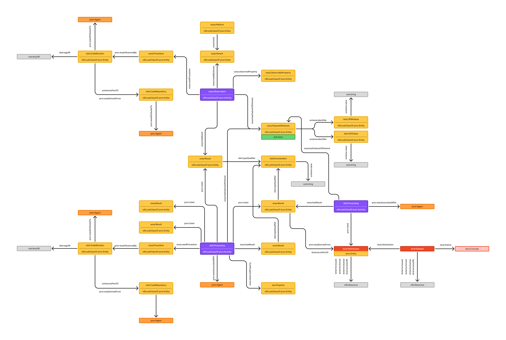

# Open Built Environment Data Ontology (DOB)

The DOB ontology provides a semantic framework for representing, integrating, and publishing data about the built environment. It is designed to support interoperability, provenance tracking, and data integration across diverse sources such as sensor networks, external datasets, and software pipelines. The ontology builds on established standards including W3C PROV-O for provenance, SOSA/SSN for sensor and observation modeling, Schema.org for general data modeling, DCAT for dataset metadata, and BOT/BEO for building topology and elements.

## Namespace Prefixes

<div align="center">

| Prefix | Namespace IIR                                 | Source/Description                                              |
|--------|-----------------------------------------------|-----------------------------------------------------------------|
| rdf    | http://www.w3.org/1999/02/22-rdf-syntax-ns#   | RDF Syntax Grammar                                              |
| rdfs   | http://www.w3.org/2000/01/rdf-schema#         | RDF Schema                                                      |
| owl    | http://www.w3.org/2002/07/owl#                | OWL2                                                            |
| skos   | http://www.w3.org/2004/02/skos/core#          | SKOS                                                            |
| dob    | https://w3id.org/dob/voc#                     | DOB Ontology vocabulary                                         |
| dop    | https://w3id.org/dob/voc/prop#                | DOB Ontology properties vocabulary                              |
| did    | https://w3id.org/dob/id/                      | DOB IDs                                                         |
| bng    | https://w3id.org/dob/voc/epsg-27700#          | British National Grid (BNG) coordinates                         |
| prov   | http://www.w3.org/ns/prov#                    | W3C PROV-O                                                      |
| bot    | https://w3id.org/bot#                         | Building Topology Ontology (BOT)                                |
| beo    | http://pi.pauwel.be/voc/buildingelement#      | Building Element Ontology (BEO)                                 |
| so     | http://schema.org/                            | Schema.org                                                      |
| sosa   | http://www.w3.org/ns/sosa/                    | SOSA/SSN                                                        |
| ssn    | http://www.w3.org/ns/ssn/                     | SSN                                                             |
| dcat   | http://www.w3.org/ns/dcat#                    | DCAT                                                            |
| dct    | http://purl.org/dc/terms/                     | Dublin Core Terms                                               |
| qudt   | http://qudt.org/schema/qudt#                  | QUDT                                                            |
| xsd    | http://www.w3.org/2001/XMLSchema#             | XML Schema Datatypes                                            |
| wgs84  | http://www.w3.org/2003/01/geo/wgs84_pos#      | WGS84 Geo                                                       |

</div>

---

## Overview

<div align="center">
    
</div>

The DOB ontology is designed to enable rich, interoperable descriptions of the built environment, including buildings, zones, sensors, observations, and the provenance of data and results. By aligning with widely adopted ontologies, DOB ensures that data can be easily linked, queried, and reused across different domains and applications. The ontology supports both raw sensor data and derived quantities, and provides mechanisms for tracking the origin, processing, and confidence of data.

---

## Core Classes

This section describes the main classes defined in the DOB ontology. These classes form the backbone of the data model, enabling the representation of identifiers, results, processing activities, code provenance, and spatial/geographical units.

<div align="center">

| Class                | Subclass Of                                 | Restrictions / Notes                                                                 | Description                                                                                                    |
|----------------------|---------------------------------------------|--------------------------------------------------------------------------------------|----------------------------------------------------------------------------------------------------------------|
| **dob:PropertyValue** | `prov:Entity`, `so:PropertyValue`           |                                                                                        | Represents a property name and value pair describing an attribute of an entity. Subclasses specialize identifier types such as UPRN, ODS, and OA.         |
| **dob:UPRNValue**    | `dob:PropertyValue`                         | `so:propertyID` = `"UPRN"`                                                            | Unique numeric identifier for a spatial addressable location in Great Britain, as defined by Ordnance Survey.               |
| **dob:ODSValue**     | `dob:PropertyValue`                         | `so:propertyID` = `"ODS"`                                                             | Identifier assigned by NHS Digital for health and social care organisations. Used for consistent referencing across health datasets.              |
| **dob:OAValue**      | `dob:PropertyValue`                         | `so:propertyID` = `"OA"`                                                              | ONS Output Area identifier for statistical geography, supporting linkage to census and demographic data.         |
| **dob:Enumeration**  | `prov:Entity`, `so:Enumeration`             |                                                                                        | Represents a controlled set of discrete values or categories for classifying results, supporting data quality and interoperability.                  |
| **dob:Processing**   | `prov:Activity`                             |                                                                                        | Describes a software-based processing workflow or activity that generates, transforms, or analyzes data, supporting provenance tracking.           |
| **dob:CodeRepository** | `prov:Entity`, `so:SoftwareSourceCode`     |                                                                                        | A version-controlled repository (e.g., Git) containing source code and configuration files for software pipelines or components.                   |
| **dob:CodeRevision**   | `prov:Entity`, `so:SoftwareSourceCode`     | `dob:tagURI` (cardinality = 1)                                                        | A specific, immutable revision of code from a repository, referenced by a tag or commit hash, enabling reproducibility.                            |
| **dob:OutputArea**     | `prov:Entity`, `so:Place`                  |                                                                                        | The smallest UK census geography unit (ONS Output Area), supporting fine-grained spatial analysis and linkage.                                      |

</div>

---

## Core Properties

DOB defines several key properties for linking entities, qualifying results, and expressing provenance and confidence. These properties enable detailed, machine-readable descriptions of data and its origins.

<div align="center">

| Property                      | Subproperty Of             | Domain Includes         | Range Includes      | Description                                                                                                   |
|-------------------------------|----------------------------|------------------------|---------------------|---------------------------------------------------------------------------------------------------------------|
| **dob:typeQualifier**         | `so:measurementQualifier`  | `sosa:Result`          | `dob:Enumeration`   | Associates a result with a controlled enumeration value, specifying the type or category of the result.       |
| **dob:tagURI**                | `so:url`                   | `dob:CodeRevision`      | `xsd:anyURI`        | URI of the specific tagged code revision (e.g., GitHub commit/tag), supporting reproducibility and traceability.|
| **dob:recommendationCode**    | `so:valueReference`        | `dob:PropertyValue`     | `xsd:string`        | General-purpose recommendation or confidence code for identifier matching, supporting data quality assessment. |
| **dob:recommendationCodeAddress** | `dob:recommendationCode` | `dob:PropertyValue` | `"A"` or `"I"` (`xsd:string`) | Address-to-UPRN match confidence: 'A' (Accept) or 'I' (Intervention required), supporting automated and manual review workflows. |

</div>

### Inverse Properties

DOB also defines inverse properties to facilitate bidirectional reasoning and querying:

- **dob:isTypeQualifierOf**: Inverse of `dob:typeQualifier`, linking from an enumeration value to all results it qualifies.
- **dob:isRecommendationForPropertyValue**: Inverse of `dob:recommendationCode`, linking from a recommendation code to the property value it applies to.
- **dob:isAddressRecommendationForPropertyValue**: Inverse of `dob:recommendationCodeAddress`, linking from an address match code to the relevant property value.

---

## Example Usage

This section illustrates how to use the DOB ontology to represent sensor observations, results, and identifier linkage in RDF/Turtle.

### Sensor Observations and Results

Sensor observations are modeled using SOSA/SSN, with results typed and qualified using DOB enumerations.

```turtle
# Example: LiDAR observation and result
did:observation-213ff099-403a-50a1-80d4-f0e61ab62c0a a sosa:Observation ;
    sosa:hasFeatureOfInterest did:zone-c7d626e6-20fb-4964-be29-a5382c1ad8fb ;
    sosa:hasResult did:63d55edf-9747-5be9-93a5-aece2658a36a ;
    sosa:madeBySensor did:lidar-122310001278 ;
    sosa:usedProcedure did:api-writer-0669539b-96b5-50b5-90e6-09e548115463,
        did:lidar-procedure-049cf124-1454-53e0-96cb-9a85cd35d5a5 .

did:63d55edf-9747-5be9-93a5-aece2658a36a a so:ImageObject, sosa:Result ;
    rdfs:label "reflectance LiDAR panorama" ;
    so:contentUrl <https://didapi.io/v1/result/63d55edf-9747-5be9-93a5-aece2658a36a.png> ;
    so:encodingFormat "image/png"^^xsd:string ;
    sosa:resultTime "2025-05-08T11:07:20+00:00"^^xsd:dateTime ;
    dob:typeQualifier did:lidar-reflectance-pano .
```

### Identifier Example

DOB supports robust cross-dataset linking using custom identifier classes.

<div align="center">
    
</div>

```turtle
did:zone-0000a75d-eaa9-409a-a588-309f4efe20eb a sosa:FeatureOfInterest, bot:Zone ;
    so:identifier did:ods-value-VNKWK .

did:ods-value-VNKWK a dob:ODSValue ;
    so:propertyID "ODS"^^xsd:string ;
    so:value "VNKWK"^^xsd:string ;
    dob:recommendationCodeAddress "A"^^xsd:string .
```

---

## BNG Properties

DOB supports spatial referencing using British National Grid (BNG) coordinates, enabling integration with UK geospatial datasets.

<div align="center">

| Property        | Description                                                                                         |
|-----------------|-----------------------------------------------------------------------------------------------------|
| **bng:easting** | Easting coordinate in EPSG:27700. See [../voc/epsg-27700/index.ttl](../voc/epsg-27700/index.ttl)    |
| **bng:nothing** | Northing coordinate in EPSG:27700. See [../voc/epsg-27700/index.ttl](../voc/epsg-27700/index.ttl)   |

</div>

---

## Building Topology

<div align="center">
    
</div>

Building topology and elements are modeled using the BOT and BEO ontologies. All zones and elements are instances of `sosa:FeatureOfInterest`, enabling detailed spatial and structural descriptions of the built environment. This supports queries about buildings, storeys, spaces, and elements such as walls and windows.

---

## Design Notes

DOB is designed for extensibility, interoperability, and provenance. Key features include:

- **Provenance**: All data, results, and transformations are linked to their provenance using PROV-O, supporting auditability and reproducibility.
- **Identifiers**: Custom identifier classes (UPRN, ODS, OA) enable robust cross-dataset linking and integration with national datasets.
- **Enumerations**: Use `dob:Enumeration` for controlled vocabularies and result typing, supporting data quality and semantic clarity.
- **Software & Processing**: Software pipelines and code provenance are modeled using `dob:CodeRepository` and `dob:CodeRevision`, supporting reproducibility.
- **Extensibility**: The ontology is modular and can be extended for new identifier types, result types, or processing activities as needed.

---

## References

#### [BEO]
Building Element Ontology. Pieter Pauwels. 2021. URL: https://pi.pauwel.be/voc/buildingelement/index-en.html

#### [BOT]
BOT Building Topology Ontology. Mads Holten Rasmussen; Pieter Pauwels; Maxime Lefrançois; Georg Ferdinand Schneider. W3C. 28 June 2021. URL: https://w3id.org/bot#

#### [DCAT-AP]
DCAT Application Profile for data portals in Europe. Version 2.0.1. European Commission. 8 June 2020. URL: https://joinup.ec.europa.eu/solution/dcat-application-profile-data-portals-europe 

#### [DCTERMS]
DCMI Metadata Terms. DCMI Usage Board. DCMI. 20 January 2020. DCMI Recommendation. URL: https://www.dublincore.org/specifications/dublin-core/dcmi-terms/ 

#### [OS]
Ordnance Survey. URL: https://www.ordnancesurvey.co.uk/

#### [ONS Geography Linked Data]
ONS Geography Linked Data. Office for National Statistics. URL: https://statistics.data.gov.uk/home

#### [ONS Open Geography Portal]
ONS Open Geography Portal. Office for National Statistics. URL: https://geoportal.statistics.gov.uk/

#### [OWL2-OVERVIEW]
OWL 2 Web Ontology Language Document Overview (Second Edition). W3C OWL Working Group. W3C. 11 December 2012. W3C Recommendation. URL: https://www.w3.org/TR/owl2-overview/ 

#### [PROV-O]
PROV-O: The PROV Ontology. Timothy Lebo; Satya Sahoo; Deborah McGuinness. W3C. 30 April 2013. W3C Recommendation. URL: https://www.w3.org/TR/prov-o/ 

#### [RDF-SCHEMA]
RDF Schema 1.1. Dan Brickley; Ramanathan Guha. W3C. 25 February 2014. W3C Recommendation. URL: https://www.w3.org/TR/rdf-schema/ 

#### [SKOS-REFERENCE]
SKOS Simple Knowledge Organization System Reference. Alistair Miles; Sean Bechhofer. W3C. 18 August 2009. W3C Recommendation. URL: https://www.w3.org/TR/skos-reference/ 

#### [VOCAB-DCAT]
Data Catalog Vocabulary (DCAT). Fadi Maali; John Erickson. W3C. 4 February 2020. W3C Recommendation. URL: https://www.w3.org/TR/vocab-dcat/ 

#### [VOCAB-SSN]
Semantic Sensor Network Ontology. Armin Haller; Krzysztof Janowicz; Simon Cox; Danh Le Phuoc; Kerry Taylor; Maxime Lefrançois. W3C. 19 October 2017. W3C Recommendation. URL: https://www.w3.org/TR/vocab-ssn/ 

#### [W3C-BASIC-GEO]
Basic Geo (WGS84 lat/long) Vocabulary. Dan Brickley. W3C Semantic Web Interest Group. 1 February 2006. URL: https://www.w3.org/2003/01/geo/ 

#### [XML-SCHEMA11-2]
W3C XML Schema Definition Language (XSD) 1.1 Part 2: Datatypes. David Peterson; Sandy Gao; Ashok Malhotra; Michael Sperberg-McQueen; Henry Thompson; Paul V. Biron et al. W3C. 5 April 2012. W3C Recommendation. URL: https://www.w3.org/TR/xmlschema11-2/ 

#### [QUDT]
QUDT - Quantities, Units, Dimensions and Data Types Ontologies. Ralph Hodgson; Paul J. Keller; Jack Hodges; Jack Spivak.18 March 2014. URL: http://www.qudt.org/
