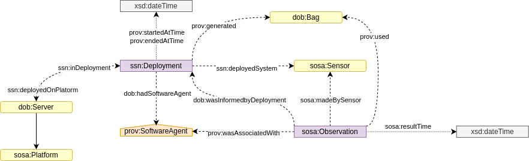
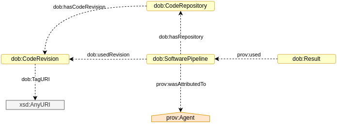
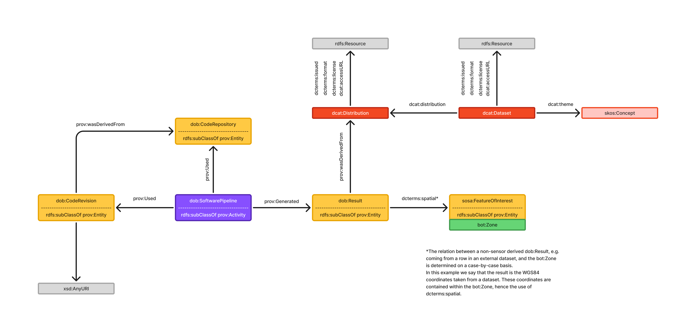

[back to readme](../README.adoc)

# DOB DRAFT Version 0.0.1

<!-- ## Contents

* [DOB Overview](#dob-overview)
* [Sensor Observations](#sensor-observations)
* [External Datasets](#external-datasets)
* [Results](#results)
* [Zone Identifier and Location](#zone-identifier-and-location)
* [Zone Topology and Elements](#zone-topology-and-elements)
* [Sensor Metadata](#sensor-metadata)
* [Software, Procedure and File Metadata](#software-procedure-and-file-metadata)
* [All Classes](#all-classes)
* [DOB Properties](#dob-properties)
* [BNG Properties](#bng-properties)
* [Predefined Instances](#predefined-instances)
* [Reused Ontologies](#reused-ontologies)
* [Alignments](#alignments) -->

<!-- Note: The diagrams align with Alex Donker's [Ontology Design Template](#ontology-design-template), as well as the colouring used in the W3C PROV Ontology [[PROV-O](#prov-o)]. -->

The following namespace prefixes are used throughout this document.

| prefix | namspace IRI                                | source                                                                         |
|--------|---------------------------------------------|--------------------------------------------------------------------------------|
| rdf    | http://www.w3.org/1999/02/22-rdf-syntax-ns# | [[RDF-SYNTAX-GRAMMER]](#rdf-syntax-grammar)              |
| rdfs   | http://www.w3.org/2000/01/rdf-schema#       | [[RDF-SCHEMA]](#rdf-schema)                              |
| owl    | http://www.w3.org/2002/07/owl#              | [[OWL2-OVERVIEW]](#owl2-overview)                        |
| skos   | http://www.w3.org/2004/02/skos/core#        | [[SKOS-REFERENCE]](#skos-reference)                      |
| dob    | https://www.w3id.org/dob/voc#                  | Namespace for the DOB Ontology vocabulary                              |
| dop    | https://www.w3id.org/dob/voc/prop#                  | Namespace for the DOB Ontology properties vocabulary                              |
| did    | https://www.w3id.org/dob/id/                   | Namespace for DOB IDs                                                  |
| bng    | https://www.w3id.org/dob/voc/epsg-27700#              | Namespace for British National Grid (BNG) coordinates                  |
| prov   | http://www.w3.org/ns/prov#                  | [[PROV-O]](#prov-o)                                      |
| bot    | https://w3id.org/bot#                       | [[BOT]](#bot)                                     |
| beo    | http://pi.pauwel.be/voc/buildingelement#    | [[BEO]](#beo)                |
| so     | http://schema.org/                          | [[SCHEMA]](#schema)                                |
| sosa   | http://www.w3.org/ns/sosa/                  | [[VOCAB-SSN]](#vocab-ssn)                                |
| ssn    | http://www.w3.org/ns/ssn/                   | [[VOCAB-SSN]](#vocab-ssn)                                |
| dcat   | http://www.w3.org/ns/dcat#                  | [[VOCAB-DCAT]](#vocab-dcat-3)                            |
| dct    | http://purl.org/dc/terms/                   | [[DCTERMS]](#dcterms) |
| qudt   | http://qudt.org/schema/qudt#                | [[QUDT]](#qudt)                                                    |
| xsd    | http://www.w3.org/2001/XMLSchema#           | [[XML-SCHEMA-11-2]](#xml-schema11-2)                      |
| wgs84  | http://www.w3.org/2003/01/geo/wgs84_pos#    | [[W3C-BASIC-GEO]](#w3c-basic-geo)                          |
| spr | http://statistics.data.gov.uk/def/spatialrelations/                  | [[ONS Geography Linked Data](#ons-geography-linked-data)] |
| sid    | http://statistics.data.gov.uk/id/statistical-geography/                     | [[ONS Geography Linked Data](#ons-geography-linked-data)] |

## DOB Overview

<div align="center">
    
</div>

The DOB Ontology uses the W3C PROV Ontology [[PROV-O](#prov-o)] as a framework. This ontology is composed of three main classes: 

* `prov:Entity`, a physical, digital, conceptual, or other kind of thing with some fixed aspects
* `prov:Activity`, something that occurs over a period of time and acts upon or with entities
* `prov:Agent`, something that bears some form of responsibility for an activity taking place, for the existence of an entity, or for another agent's activity

PROV-O expresses the W3C PROV standard PROV-DM [[PROV-DM](#prov-dm)] as an OWL ontology.

We have chosen to use this ontology as a framework as it is very flexible and allows us to easily extend our ontology when needed. 

Generally we aim to be as based around the SOSA Ontology [VOCAB-SSN](#vocab-ssn) as possible This allows for both consistency between the different types and sources of data but also interoperability between different systems. A description of the alignments between SOSA our ontology is described [here](#alignments/alignments.ttl).

<!-- Classes and properties in this diagram:
* [dob:Result](#dobresult)
* prov:Activity [[PROV-O](#prov-o)]
* prov:Plan [[PROV-O](#prov-o)]
* skos:Concept [[SKOS-REFERENCE](#skos-reference)]
* ssn:Property [[VOCAB-SSN](#vocab-ssn)]
* ssn:Deployment [[VOCAB-SSN](#vocab-ssn)]
* sosa:FeatureOfInterest [[VOCAB-SSN](#vocab-ssn)]
* dcat:Distribution [[VOCAB-DCAT](#vocab-dcat)]
* [dob:usedProcedure](#dobusedprocedure)
* [dob:wasInformedByDeployment](#dobwasinformedbydeployment)
* prov:used [[PROV-O](#prov-o)]
* prov:generated [[PROV-O](#prov-o)]
* prov:wasGeneratedBy [[PROV-O](#prov-o)]
* prov:endedAtTime [[PROV-O](#prov-o)]
* prob:wasQuotedFrom [[PROV-O](#prov-o)]
* ssn:hasProperty [[VOCAB-SSN](#vocab-ssn)]
* ssn:forProperty [[VOCAB-SSN](#vocab-ssn)]
* sosa:hasFeatureOfInterest [[VOCAB-SSN](#vocab-ssn)]
* sosa:isFeatureOfInterestOf [[VOCAB-SSN](#vocab-ssn)]
* xsd:dateTime [[XML-SCHEMA11-2](#xml-schema11-2)] -->
# DOB Classes

| Class                | Subclass Of                                                                                                                                                                                                                                                       | Restrictions                                                                                                                                                                                                                                                                                                                                                                                                                              | Description                                                                                                                                                                                                                                                                                                                                                                                                                              |
|----------------------|-------------------------------------------------------------------------------------------------------------------------------------------------------------------------------------------------------------------------------------------------------------------|------------------------------------------------------------------------------------------------------------------------------------------------------------------------------------------------------------------------------------------------------------------------------------------------------------------------------------------------------------------------------------------------------------------------------------------|------------------------------------------------------------------------------------------------------------------------------------------------------------------------------------------------------------------------------------------------------------------------------------------------------------------------------------------------------------------------------------------------------------------------------------------|
| **dob:AtomicResult**       | `prov:Entity`                                                                                                                                                                                                        |                                                                                                                                                                                                                                | A distinct and identifiable data point/object extracted from a dataset. Collections or aggregations are not represented. Anything that can be considered a single instance of data from a dataset can be a dob:AtomicResult e.g. an single image from a collection can be a dob:Result. Results may be imported as atomic data units from external datasets, where they were originally generated through sensing or computational processes. This can also be a single row in a table from an external dataset.                                                                                                                                                  |
| **dob:DerivedResult**       | `prov:Entity`                                                                                                                                                                                                        |                                                                                                                                                                                                                                | These are results derived from other results from sensor data and/or from other datasets via dob:Processing. E.g. a dob:DerivedResult can be arrived by taking input from 3 sosa:Results and one dob:AtomicResult.                                                                                                                                                 |
| **dob:PropertyValue** | `prov:Entity`, `schema:PropertyValue`                                                                                                                                                                                                                            |                                                                                                                                                                                                                                                                                                                                                                                                                                          | A pair consisting of a property name and a specific value, used to describe a feature or attribute of an entity. Subclasses of PropertyValue specialize the kind of identifier or characteristic being captured. Typically, use schema.org-specific properties where available.                                                                                                                                                                                                                                                                                                                                                                         |
| **dob:UPRNValue**    | `dob:PropertyValue`                                                                                                                                                                                                                       | `schema:propertyID` ⟶ hasValue `"UPRN"`                                                                                                                                                                                                                                                                                                                                                                           | A unique numeric identifier for a spatial addressable location in Great Britain, as defined by the Ordnance Survey. Used to unambiguously reference properties across datasets.                                                                                                                                                                                                                                                                                                                                                              |
| **dob:ODSValue**     | `dob:PropertyValue`                                                                                                                                                                                                                       | `schema:propertyID` ⟶ hasValue `"ODS"`                                                                                                                                                                                                                                                                                                                                                                            | An identifier assigned by NHS Digital for organisations involved in health and social care across England and associated services. Used for consistent referencing across health datasets.                                                                                                                                                                                                            |
| **dob:Processing** | `prov:Activity`                                                                                                                                                                                                                       |                                                                                                                                                                                                                                                                                                                                                                                                                                          | An instance of a software-based processing workflow that executes a defined sequence of computational steps or components. Represents a concrete activity that generates, transforms, or analyzes data as part of a broader processing system and generates a dob:DerivedResult.                                                                                                                                                                                                                                                                                                                      |
| **dob:Enumeration** | `prov:Entity`, `so:Enumeration`                                                                                                                                                                                                                       |                                                                                                                                                                                                                                                                                                                                                                                                                                          | A set of discrete values or categories that can be used to classify or describe a dob:AtomicResult or dob:DerivedResult. Enumerations are used to represent a limited set of options or choices. This aids large language models in finding particular asset types when querying data structured with the dob ontology.                                                                                                                                                                                                                                                                                                                         |
| **dob:CodeRepository**   | `prov:Entity`, `schema:SoftwareSourceCode`                                                                                                                                                                                                                       |                                                                                                                                                                                                                                                                                                                                                                                                                                          | A version-controlled repository (e.g., Git) containing source code and configuration files for software pipelines or components.                                                                                                                                                                                                                                                                                                                                                   |
| **dob:CodeRevision**     | `prov:Entity`,`schema:SoftwareSourceCode`                                                                                                                                                                                        | `dob:tagURI` (cardinality = 1)                                                                                                                                                                                                                                                                                                                                                                                    | A specific, immutable revision of code from a version-controlled repository, typically referenced by a tag or commit hash. Used to unambiguously associate a software pipeline execution with the exact code used.                                                                                                                                                                                                                                                                              |

---

# DOB Properties

| Property                 | Subproperty Of                         | Domain Includes                | Range Includes       | Description                                                                                             |
|--------------------------|----------------------------------------|------------------------|-------------|---------------------------------------------------------------------------------------------------------|
| **dob:typeQualifier**           | `so:measurementQualifier`                           | `dob:AtomicResult`, `dob:DerivedResult`     | `dob:Enumeration` | A property that qualifies the type of dob:AtomicResult or dob:DerivedResult. This property is used to specify the type of data or result being represented and can only have a limited number of options in a given dob structured dataset as it relates to the dob:Enumeration class.                                                  |
| **dob:tagURI**           | `so:url`                           | `dob:CodeRevision`     | `xsd:anyURI` | A full URI pointing to the specific tagged revision of a codebase (e.g., a GitHub tag or commit URI).                                                   |
| **dob:recommendationCode**  | `so:valueReference`| `dob:PropertyValue`   | `xsd:string` | A general-purpose recommendation or confidence code used to qualify the strength or reliability of identifier matching                                             |
| **dob:recommendationCodeAddress** | `dob:recommendationCode`           | `dob:PropertyValue` | `xsd:string` | A confidence code output by the address-to-uprn matching algorithm: 'A' (Accept) or 'I' (Requires clerical Intervention).                            |

Inverse properties are also defined for object type properties to aid the reasoner, these are not described in detail for brevity.

- dob:isTypeQualifierOf
- dob:isRecommendationForPropertyValue
- dob:isAddressRecommendationForPropertyValue 

# BNG Properties

<div align="center">

| Property          | Description                                                                                       |
|-------------------|---------------------------------------------------------------------------------------------------|
| **bng:easting**   | Easting coordinate in EPSG:27700. <br><br>**For more documentation, see:** [../voc/epsg-27700/index.ttl](../voc/epsg-27700/index.ttl)   |
| **bng:nothing**   | Northing coordinate in EPSG:27700. <br><br>**For more documentation, see:** [../voc/epsg-27700/index.ttl](../voc/epsg-27700/index.ttl)  |

</div>


## Predefined Instances

A list of predefined instances will be released. This will include a list of instances of `ssn:Property`. 

An incomplete list is available under the [DOP](../voc/prop/index.ttl) vocabulary.

<!-- ## Results

This may not be an issue for small knowledge graphs but we immediately create a bot:zone for every domicile in the UK, plus we require a prov process to keep track of how this is generated from the OS Open UPRN dataset. Hence we save 40 million triples at start by creating our dob:Result.

Additionally defining results in this manner allows easy comparison between observations of properties made by our own systems, and those contained in datasets captured and curated by others.

The general structure is as follows:

* The property being described would fall under `ssn:Property`. This would link to the relevant `sosa:FeatureOfInterest` and `prov:Activity`. Which is of course all economcially captured by dob:Result. A working list of properties is available in [Predefined Instances](#predefined-instances)
* Basic numerical properties (such as height) are described using QUDT. For example, the height of a window would look like:

```turtle
did:result_b55f2b0f-0a30-4863-b93e-e9e6d943d637 a dob:Result ;
    prov:used did:pipeline_height_dgfhvuy63-4621-4b50-b2e6-597ee05f86785 ;
    sosa:hasFeatureOfInterest did:zone_a7d8239e-a998-46ca-9b38-6de906701389 ;
    ssn:forProperty dop:Height
    qudt:numericValue "0.52"^^xsd:float ;
    qudt:hasUnit qudt-unit:M .

did:zone_a7d8239e-a998-46ca-9b38-6de906701389 a sosa:FeatureOfInterest,
        bot:Zone ;
    sosa:isFeatureOfInterestOf did:result_b55f2b0f-0a30-4863-b93e-e9e6d943d637 ;
    schema:identifier did:uprn_906700039263 .

did:uprn_906700039263 a dob:UPRNValue ;
    schema:value "906700039263" .
``` -->

<!-- ```turtle
did:result_1234 a dob:Result , qudt:QuantityValue ;
    prov:wasGeneratedBy did:activity_1234 ;
    qudt:numericValue "0.52"^^xsd:float ;
    qudt:hasUnit qudt-unit:M .
    
did:activity_1234 a prov:Activity ;
    prov:generated did:result_1234 ;
    sosa:hasFeatureOfInterest did:window_1234 ;
    ssn:forProperty dop:Height .
``` -->

<!-- * Non-numerical properties (such as energy ratings and material) use either existing object/datatype properties from other vocabularies or custom properties. This property would then refer to a code-list (if relevent), which are instances of `skos:Concept`. An example for energy ratings is shown below.

```turtle
did:result_b55f2b0f-0a30-4863-b93e-e9e6d943d637 a dob:Result ;
    prov:used did:pipeline_os_uprn_ttl_c67cc713-4621-4b50-b2e6-597ee05f5f2a ;
    sosa:hasFeatureOfInterest did:zone_a7d8239e-a998-46ca-9b38-6de906701389 ;
    ssn:forProperty dop:EnergyRating .
    dop:energyRating dop:EPC_Energy_Rating_A ;
    dop:energyRatingSystem dop:UK_EPC ;
    dct:issued "2024-01-01"^^xsd:date .

did:zone_a7d8239e-a998-46ca-9b38-6de906701389 a sosa:FeatureOfInterest,
        bot:Zone ;
    sosa:isFeatureOfInterestOf did:result_b55f2b0f-0a30-4863-b93e-e9e6d943d637 ;
    schema:identifier did:uprn_906700039263 .

did:uprn_906700039263 a dob:UPRNValue ;
    schema:value "906700039263" .
``` -->

<!-- ```turtle
did:result_1235 a dob:Result ;
    prov:wasGeneratedBy did:activity_1235 ;
    dop:energyRating dop:EPC_Energy_Rating_A ;
    dop:energyRatingSystem dop:UK_EPC ;
    dct:issued "2024-01-01"^^xsd:date .
    
did:activity-1235 a prov:Activity ;
    prov:generated did:result_1235 ;
    sosa:hasFeatureOfInterest did:zone_1235 ;
    ssn:forProperty dop:EnergyRating .
```

```turtle
did:result_1236 a dob:Result ;
    prov:wasGeneratedBy did:activity_1236 ;
    sosa:hasSimpleResult dop:AluminiumWood ; ????
    dct:issued "2024-01-01"^^xsd:date .
    
did:activity-1236 a prov:Activity ;
    prov:generated did:result_1236 ;
    sosa:hasFeatureOfInterest did:zone_1235 ;
    ssn:forProperty dop:ConstructionType .
``` -->

<!-- These custom properties are not well developed so are not documented here. 

* Exceptions may be made for common numerical properties like latitude and longitude, which would use the more common `wgs84:lat` and `wgs84:long` [[W3C BASIC GEO](#w3c-basic-geo)].

If we proceed with the above structure, a table of instances of `ssn:Property` [[VOCAB SSN](#vocab-ssn)] and their associated object/datatype properties will be released. 

The codelists used may include those recommended or created by 

* [ONS](https://github.com/ONSdigital/application-profile/blob/draft/code-lists.md)
* [SDMX](http://purl.org/linked-data/sdmx/2009/code#)
* [DCAT-AP](https://semiceu.github.io/DCAT-AP/releases/3.0.0/#controlled-vocs) -->


## Sensor Observations

<!-- <div align="center">
    
</div> -->

The sensor observations are compliant with the SOSA/SSN ontology [[VOCAB-SSN](#vocab-ssn)], and therefore have the following restrictions:
* The observation must be connected to 1 Feature Of Interest
* The observation must be made by 1 Sensor
* The observation took place at a particular time

Using `sosa:Observation` is useful when we want the data to be linked back to a particular sensor, or we want to know exactly when the data was taken.

It might not be suitable to release the raw data from our sensors, as the data is often difficult to interpret or has privacy issues. In these cases, an additional step (represented by `dob:Processing`) may be required to transform the data. For instance, let's consider the height of a window. The data ultimately comes from a 3D observation of the building made by the Lidar sensor, so it takes an extra step (the `dob:Processing`) to extract the height of the window from the initial raw data. This also allows us to describe in further detail when the processing took place and what software and procedure was used to generate the data. The final output is a `dob:DerivedResult.`

Where results are meaningful assets, e.g. RGB images, such images will of class `sosa:Result`.

<!-- Classes and properties in this diagram:

* [dob:Result](#dobresult)
* prov:Activity [[PROV-O](#prov-o)]
* prov:Plan [[PROV-O](#prov-o)]
* prov:Agent [[PROV-O](#prov-o)]
* skos:Concept [[SKOS-REFERENCE](#skos-reference)]
* ssn:Property [[VOCAB-SSN](#vocab-ssn)]
* ssn:Deployment [[VOCAB-SSN](#vocab-ssn)]
* sosa:FeatureOfInterest [[VOCAB-SSN](#vocab-ssn)]
* sosa:Sensor [[VOCAB-SSN](#vocab-ssn)]
* sosa:Observation [[VOCAB-SSN](#vocab-ssn)]
* dcat:Distribution [[VOCAB-DCAT](#vocab-dcat)]
* [dob:usedProcedure](#dobusedprocedure)
* prov:used [[PROV-O](#prov-o)]
* prov:generated [[PROV-O](#prov-o)]
* prov:wasGeneratedBy [[PROV-O](#prov-o)]
* prov:wasAssociatedWith [[PROV-O](#prov-o)]
* prov:wasInformedBy [[PROV-O](#prov-o)]
* ssn:deployedSystem [[VOCAB-SSN](#vocab-ssn)]
* sosa:hasFeatureOfInterest [[VOCAB-SSN](#vocab-ssn)]
* sosa:isFeatureOfInterestOf [[VOCAB-SSN](#vocab-ssn)]
* sosa:madeBySensor [[VOCAB-SSN](#vocab-ssn)]
* sosa:madeObservation [[VOCAB-SSN](#vocab-ssn)]
* sosa:resultTime [[VOCAB-SSN](#vocab-ssn)] -->

## Sensor Metadata

<!-- <div align="center">
    
</div> -->

Sensors and their properties are described using the [Semantic Sensor Network Ontology](#vocab-ssn). We will likely only include basic information in the graph, e.g. camera type, device serial, which INS it is deployed with. Full calibration files describing sensor geometry for sensor fusion purposes will be linked to as URI literals.

This section of the ontology is currently unstable and will be for internal use. Describing sensor systems will likely only be of interest/use to xRI for data provenance purporses. 

## Software Pipelines

<!-- <div align="center">
    
</div> -->

Inspiration is taken from prov as well as [MLFlow2PROV](#mlflow2prov), however we opt for an initially simpler description of software pipelines by linking to repositories, which can have lots of information about authorship etc... and then we only really require knowledge of a tagged release of source code to know the code used from this repository that is used in a pipeline. A software pipeline can link to multiple repositories. We accept the current limitation of not knowing which script(s) is directly employed, this may be a direction of future development. However, encouraging atomic repos with singular purposes may generally be good practice for managing pipeline provenance so this may not be an issue and simply an opinated way in which to develop data processing that is surfaced as linked data.


## External Datasets

<!-- <div align="center">
    
</div> -->

This is data that is taken directly from external datasets, such as from the Office for National Statistics [[ONSOpen Geography Portal](#ons-open-geography-portal)] or Ordnance Survey [[OS](#os)] websites. Metadata about datasets is described using the Data Catalog Vocabulary [[VOCAB DCAT](#vocab-dcat)].

DCAT is widely used in open linked data. Some of the organisations that use DCAT are [ONS (Office for National Statistics)](https://github.com/ONSdigital/application-profile/blob/531fd289f8200491ae7b21d18978bdc8cd565704/cataloguing.md), European Data Portal [[DCAT-AP](#dcat-ap)], and US Department of the Interior [[DCAT-US](#dcat-us)]. 

We represent activities that use data from external datasets by the property `prov:used` attached to an instance of the class `dcat:Distribution`. The `dcat:Distribution` is then described by its release date, format, licence and (optionally) access URL. Other metadata such as publisher, themes, frequency, spatial/geographical coverage, etc. are properties of the associated `dcat:Dataset`.

We make use of our `dob:AtomicResult` to represent instance data from external datasets, this allows its representation in the graph as well in combination with `sosa:Results` and `dob:DerivedResults` to generate further `dob:DerivedResults`

<!-- Classes and properties in this diagram:

* [dob:Result](#dobresult)
* prov:Activity [[PROV-O](#prov-o)]
* skos:Concept [[SKOS-REFERENCE](#skos-reference)]
* ssn:Property [[VOCAB-SSN](#vocab-ssn)]
* sosa:FeatureOfInterest [[VOCAB-SSN](#vocab-ssn)]
* dcat:Distribution [[VOCAB-DCAT](#vocab-dcat)]
* dcat:Dataset [[VOCAB-DCAT](#vocab-dcat)]
* prov:used [[PROV-O](#prov-o)]
* prov:generated [[PROV-O](#prov-o)]
* prov:wasGeneratedBy [[PROV-O](#prov-o)]
* prov:wasQuotedFrom [[PROV-O](#prov-o)]
* sosa:hasFeatureOfInterest [[VOCAB-SSN](#vocab-ssn)]
* sosa:isFeatureOfInterestOf [[VOCAB-SSN](#vocab-ssn)]
* dcat:accessURL [[VOCAB-DCAT](#vocab-dcat)]
* dcat:theme [[VOCAB-DCAT](#vocab-dcat)]
* dcat:distribution [[VOCAB-DCAT](#vocab-dcat)]
* dct:format [[DCTERMS](#dcterms)]
* dct:license [[DCTERMS](#dcterms)]
* dct:issued [[DCTERMS](#dcterms)]
* dct:publisher [[DCTERMS](#dcterms)]
* dct:spatial [[DCTERMS](#dcterms)]
* dct:title [[DCTERMS](#dcterms)]
* dct:description [[DCTERMS](#dcterms)] -->

## Zone Identifier and Location

<div align="center">
    
</div>

Instances of `bot:Zone` serve as our unique identifiers for buildings, storeys, spaces and sites, and all data released ultimately links back to a `bot:Zone`.

The class `bot:Zone` [[BOT](#bot)] is defined as "A part of the physical world or a virtual world that is inherently both located in this world and has a 3D spatial extent". This includes individual buildings, a site such as a school or park, individual flats or even specific rooms. The reason for using this class is because of the range of objects that UPRNs [[UPRN](#uprn)] have been assigned to (they have been assigned to objects like bus shelters and post boxes). 

As UPRNs are intrinsic to the building and describe the building all the way from its construction to demolition. This is described as a subclass of the schema:PropertyValue, this approach allows the creation of custom identifier classes for more than just UPRN and allows the alignment of multiple identifier systems.

The `within:outputarea` property is an [ONS Geography Linked Data](#ons-geography-linked-data) property, and the E00 identifier refers to a specific output area. This is used to enable us to use their [SPARQL endpoint](https://statistics.data.gov.uk/sparql) [[SPARQL](#sparql)] for querying to allow for more detailed location data. 

An [output area](https://www.ons.gov.uk/methodology/geography/ukgeographies/statisticalgeographies) [[ONS Geography Linked Data](#ons-geography-linked-data)] is the lowest level of geographical area for census statistics. It is maintained by the ONS and is updated every 10 years following the census. 

<!-- Classes and properties in this diagram:

* `bot:Zone` [[BOT](#bot)]
* [dob:hasUPRN](#dobhasuprn)
* `within:outputarea` [[ONS Geography Linked Data](#ons-geography-linked-data)]
* `sid:` [[ONS Geography Linked Data](#ons-geography-linked-data)] -->

## Zone Topology and Elements

<div align="center">
    
</div>

All zones and elements are instances of `sosa:FeatureOfInterest`. Building topology is described in detail with the [Building Topology Ontology](https://w3c-lbd-cg.github.io/bot/) [[BOT](#bot)], and building elements are described with the [Building Element Ontology](https://pi.pauwel.be/voc/buildingelement/index-en.html) [[BEO](#beo)].

<!-- Classes and properties in this diagram:

* bot:Zone [[BOT](#bot)]
* bot:Building [[BOT](#bot)]
* bot:Storey [[BOT](#bot)]
* bot:Element [[BOT](#bot)]
* beo:Wall [[BEO](#beo)]
* beo:Window [[BEO](#beo)]
* bot:hasElement [[BOT](#bot)]
* bot:hasStorey [[BOT](#bot)]
* bot:hasSubElement [[BOT](#bot)] -->

## Reused Ontologies

#### PROV Ontology

Our ontology reuses the PROV Ontology [[PROV-O](#prov-o)]. This ontology is used as the underlying framework for our ontology, with all classes sub-classed to one or more of `prov:Entity`, `prov:Activity` and `prov:Agent`. Most properties are also aligned to PROV-O properties.

#### BOT Ontology

Our ontology reuses the Building Topology Ontology [[BOT](#bot)]. This ontology describes the core topological concepts on buildings. All instances are subclassed to `sosa:FeatureOfInterest`.

#### BEO Ontology

The Building Element Ontology [[BEO](#beo)] provides an ontology based on the IfcBuildingElement subtree in the IFC specification. All `beo:BuildingElement` instances are subclassed to `bot:Element` and `sosa:FeatureOfInterest`.

#### SOSA SSN Ontology

The Semantic Sensor Network Ontology [[VOCAB-SSN](#vocab-ssn)] is used to describe sensors and their observations. SSN contains a core lightwight ontology called SOSA (Sensor, Observation, Sample, and Actuator), which we are using a framework for our results. 

#### DCAT Ontology

The Data Catalog Vocabulary [[VOCAB-DCAT](#vocab-dcat-3)] is used to describe external datasets. This is used to describe the metadata of the datasets, such as publisher, themes, frequency, spatial/geographical coverage, etc.

## Alignments

As the ontology uses the PROV ontology [[PROV-O](#prov-o)] as a framework, all classes and properties are aligned with PROV-O.

We are using the existing alignments:

**DCTERMS to PROV Alignment** [[PROV-DC](#prov-dc)]

**SOSA to PROV Alignment** [[SOSA-PROV](#sosa-prov)]

There exists an alignment from DCAT to PROV, however it is provisional and incomplete. The alignment is available [here](https://github.com/w3c/dxwg/blob/gh-pages/dcat/rdf/dcat-prov.ttl).

There is also no alignment between many SSN terms and PROV, however an old alignments that use the outdated version of SSN can be found [here](https://github.com/Semantic-Observations/obs-models/blob/master/ontologies/PROV_SSN.ttl) and discussed [here](https://ceur-ws.org/Vol-1401/tc-ssn2014-complete.pdf#page=69) [[SSN-PROV](#ssn-prov)].

We cannot find any existing alignments between BOT and PROV, and BEO and PROV.

We have created our own alignments between our ontology and other ontologies, which are available in Turtle format [here](alignments/alignment.ttl).

## References

#### [BEO]
Building Element Ontology. Pieter Pauwels. 2021. URL: https://pi.pauwel.be/voc/buildingelement/index-en.html

#### [BOT]
BOT Building Topology Ontology. Mads Holten Rasmussen; Pieter Pauwels; Maxime Lefrançois; Georg Ferdinand Schneider. W3C. 28 June 2021. URL: https://w3id.org/bot#

#### [DCAT-AP]
DCAT Application Profile for data portals in Europe. Version 2.0.1. European Commission. 8 June 2020. URL: https://joinup.ec.europa.eu/solution/dcat-application-profile-data-portals-europe 

#### [DCAT-US]
Data Catalog Application Profile for the United States of America. Thomas Dabolt; Michael Ratcliffe; Open Government Data; Stephane Fellah; Sofiane Fellah; John Davidson. Candidate Recommendation Snapshot. 7 March 2024. URL: https://doi-do.github.io/dcat-us/

#### [DCTERMS]
DCMI Metadata Terms. DCMI Usage Board. DCMI. 20 January 2020. DCMI Recommendation. URL: https://www.dublincore.org/specifications/dublin-core/dcmi-terms/ 

#### [DLProv]
Débora Pina, Adriane Chapman, Liliane Kunstmann, Daniel de Oliveira, and Marta Mattoso. 2024. DLProv: A Data-Centric Support for Deep Learning Workflow Analyses. In Proceedings of the Eighth Workshop on Data Management for End-to-End Machine Learning (DEEM '24). Association for Computing Machinery, New York, NY, USA, 77–85. https://doi.org/10.1145/3650203.3663337

#### [IANA-MEDIA-TYPES]
Media Types. IANA. URL: https://www.iana.org/assignments/media-types/ 

#### [MLFlow2PROV]
Marius Schlegel and Kai-Uwe Sattler. 2023. MLflow2PROV: Extracting Provenance from Machine Learning Experiments. In Proceedings of the Seventh Workshop on Data Management for End-to-End Machine Learning (DEEM '23). Association for Computing Machinery, New York, NY, USA, Article 9, 1–4. https://doi.org/10.1145/3595360.3595859

#### [OS]
Ordnance Survey. URL: https://www.ordnancesurvey.co.uk/

#### [ONS Geography Linked Data]
ONS Geography Linked Data. Office for National Statistics. URL: https://statistics.data.gov.uk/home

#### [ONS Open Geography Portal]
ONS Open Geography Portal. Office for National Statistics. URL: https://geoportal.statistics.gov.uk/

#### [Ontology Design Template]
Donkers, A. (2022). Ontology Design Template. https://doi.org/10.5281/zenodo.6816899

#### [OWL2-OVERVIEW]
OWL 2 Web Ontology Language Document Overview (Second Edition). W3C OWL Working Group. W3C. 11 December 2012. W3C Recommendation. URL: https://www.w3.org/TR/owl2-overview/ 

#### [OWL2-SYNTAX]
OWL 2 Web Ontology Language Structural Specification and Functional-Style Syntax (Second Edition). Boris Motik; Peter Patel-Schneider; Bijan Parsia. W3C. 11 December 2012. W3C Recommendation. URL: https://www.w3.org/TR/owl2-syntax/ 

#### [PROV-DC]
Daniel Garijo; Kai Eckert; eds. Dublin Core to PROV Mapping. 30 April 2013, W3C Note. URL : http://www.w3.org/TR/2013/NOTE-prov-dc-20130430/

#### [PROV-DM]
Luc Moreau; Paolo Missier; eds. PROV-DM: The PROV Data Model. 30 April 2013, W3C Recommendation. URL: http://www.w3.org/TR/2013/REC-prov-dm-20130430/

#### [PROV-O]
PROV-O: The PROV Ontology. Timothy Lebo; Satya Sahoo; Deborah McGuinness. W3C. 30 April 2013. W3C Recommendation. URL: https://www.w3.org/TR/prov-o/ 

#### [RDF-SYNTAX-GRAMMAR]
RDF 1.1 XML Syntax. Fabien Gandon; Guus Schreiber. W3C. 25 February 2014. W3C Recommendation. URL: https://www.w3.org/TR/rdf-syntax-grammar/ 

#### [RDF-SCHEMA]
RDF Schema 1.1. Dan Brickley; Ramanathan Guha. W3C. 25 February 2014. W3C Recommendation. URL: https://www.w3.org/TR/rdf-schema/ 

#### [SKOS-REFERENCE]
SKOS Simple Knowledge Organization System Reference. Alistair Miles; Sean Bechhofer. W3C. 18 August 2009. W3C Recommendation. URL: https://www.w3.org/TR/skos-reference/ 

#### [SPARQL]
SPARQL 1.1 Query Language. Steve Harris; Andy Seaborne; Eric Prud'hommeaux. 21 March 2013. W3C Recommendation. URL: https://www.w3.org/TR/sparql11-query/

#### [SSN-PROV]
Sensor Data Provenance: SSNO and PROV-O Together at Last. Michael Compton; David Corsar; Kerry Taylor. CEUR: 7th International Conference on Semantic Sensor Networks. 2014. URL: http://ceur-ws.org/Vol-1401/paper-05.pdf 

#### [Turtle]
RDF 1.1 Turtle. Eric Prud'hommeaux; Gavin Carothers. W3C. 25 February 2014. W3C Recommendation. URL: https://www.w3.org/TR/turtle/ 

#### [UPRN]
Unique Property Reference Number (UPRN). GeoPlace. URL: https://www.geoplace.co.uk/addresses/unique-property-reference-number-uprn

#### [VOCAB-DCAT]
Data Catalog Vocabulary (DCAT). Fadi Maali; John Erickson. W3C. 4 February 2020. W3C Recommendation. URL: https://www.w3.org/TR/vocab-dcat/ 

#### [VOCAB-SSN]
Semantic Sensor Network Ontology. Armin Haller; Krzysztof Janowicz; Simon Cox; Danh Le Phuoc; Kerry Taylor; Maxime Lefrançois. W3C. 19 October 2017. W3C Recommendation. URL: https://www.w3.org/TR/vocab-ssn/ 

#### [W3C-BASIC-GEO]
Basic Geo (WGS84 lat/long) Vocabulary. Dan Brickley. W3C Semantic Web Interest Group. 1 February 2006. URL: https://www.w3.org/2003/01/geo/ 

#### [XML-SCHEMA11-2]
W3C XML Schema Definition Language (XSD) 1.1 Part 2: Datatypes. David Peterson; Sandy Gao; Ashok Malhotra; Michael Sperberg-McQueen; Henry Thompson; Paul V. Biron et al. W3C. 5 April 2012. W3C Recommendation. URL: https://www.w3.org/TR/xmlschema11-2/ 

#### [QUDT]
QUDT - Quantities, Units, Dimensions and Data Types Ontologies. Ralph Hodgson; Paul J. Keller; Jack Hodges; Jack Spivak.18 March 2014. URL: http://www.qudt.org/
