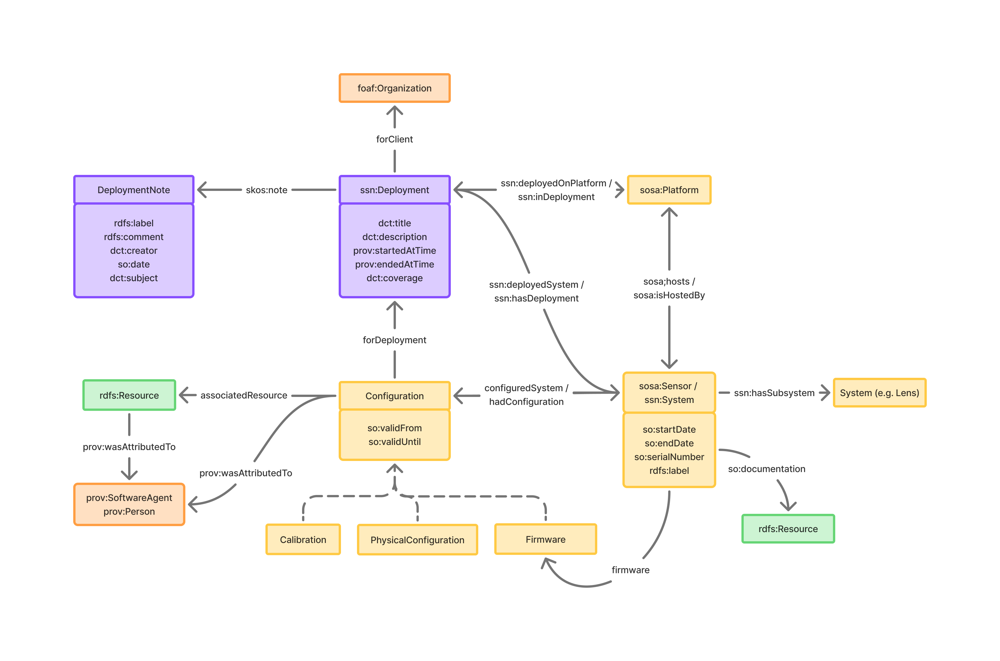

# Sensor Metadata and Deployment Ontology

---

## Introduction

The **Sensor Metadata and Deployment (SMD) Ontology** is an unofficial extension of the W3C Semantic Sensor Network (SSN) ontology designed to provide more detailed descriptions of deployments and sensor configurations and metadata.

The SMD Ontology extends SSN by providing a more robust framework for describing sensor configurations, including calibration, physical setup and firmware, as well adding new classes and properties to extend the structure around the Deployment class.

### A New Configuration Class

While SSN encourages the use of `sosa:Procedure` to describe operational details such as measurement or sampling methods, it does not adequately represent the state of a sensor system (i.e., its configuration) at a given point in time. Procedures describe how observations are made; whereas configurations describe what state the system was in when those procedures were executed (e.g., firmware version, lens type, calibration settings). These are fundamentally different concepts.

While SSN permits procedures to reference inputs (which may include configuration parameters) via `ssn:hasInput`, there is no clear guidance or structure for modeling configuration details this way. The documentation does not specify how to represent a change of parameters or components, or physical setup, nor how to scope them temporally. As a result, attempting to model configuration as a type of procedure input leads to inconsistency, ambiguity, and limited interoperability. 

A dedicated configuration class directly addresses this gap, and can also be used alongside `sosa:Procedure` via the property `ssn:hasInput`. 

---

## Overview



---

## Namespaces

The following namespaces are used in this document.

| Prefix  | Namespace URI                                  |
| ------- | ---------------------------------------------- |
| `rdf`   | `http://www.w3.org/1999/02/22-rdf-syntax-ns#`  |
| `rdfs`  | `http://www.w3.org/2000/01/rdf-schema#`        |
| `owl`   | `http://www.w3.org/2002/07/owl#`               |
| `smd`   | `http://example.org/ont/smd#`                  |
| `ssn`   | `http://www.w3.org/ns/ssn/`                    |
| `sosa`  | `http://www.w3.org/ns/sosa/`                   |
| `so`    | `http://schema.org/`                           |
| `prov`  | `http://www.w3.org/ns/prov#`                   |
| `dct`   | `http://purl.org/dc/terms/`                    |
| `foaf`  | `http://xmlns.com/foaf/0.1/`                   |
| `skos`  | `http://www.w3.org/2004/02/skos/core#`         |
| `xsd`   | `http://www.w3.org/2001/XMLSchema#`            |

---

## Classes

### `smd:Configuration`

A configuration or setup of a sensor, including calibration, physical configuration, and firmware.

* **Superclass:** `prov:Entity`

---

### `smd:Calibration`

The calibration of a sensor, which includes parameters and settings used to ensure accurate measurements.

* **Superclass:** `smd:Configuration`

---

### `smd:PhysicalConfiguration`

The physical configuration of a sensor, including its placement, orientation, and other physical attributes.

* **Superclass:** `smd:Configuration`

---

### `smd:Firmware`

The firmware used by a sensor, which controls its operation and functionality.

* **Superclass:** `smd:Configuration`

---

### `smd:DeploymentNote`

A note or comment related to a deployment. This may include but is not limited to: descriptive, contextual, operational or performance information.

* **Superclass:** `prov:Entity`

---

## Properties

### `smd:firmware`

The firmware used by the sensor.

* **Type:** Object Property
* **Domain:** `ssn:System`
* **Range:** `smd:Firmware`

---

### `smd:configuredSystem`

Indicates the system to which the configuration is applied.

* **Type:** Object Property
* **Domain:** `smd:Configuration`
* **Range:** `ssn:System`
* **Inverse Property:** `smd:hasConfiguration`

---

### `smd:hadConfiguration`

Indicates that a sensor or system had a specific configuration applied.

* **Type:** Object Property
* **Domain:** `ssn:System`
* **Range:** `smd:Configuration`
* **Inverse Property:** `smd:configuresSystem`

---

### `smd:forDeployment`

The deployment that the configuration is intended for.

* **Type:** Object Property
* **Domain:** `smd:Configuration`
* **Range:** `ssn:Deployment`

---

### `smd:configurationResource`

A resource that contains the configuration details of the sensor configuration.

* **Type:** Object Property
* **Domain:** `smd:Configuration`

---

### `smd:deploymentNote`

A note or comment related to the deployment.

* **Type:** Object Property
* **Domain:** `smd:Deployment`
* **Range:** `smd:DeploymentNote`
* **Subproperty of:** `skos:note`

---

### `smd:forClient`

The client associated with this deployment.

* **Type:** Object Property
* **Domain:** `smd:Deployment`
* **Range:** `foaf:Agent`
* **Subproperty of:** `prov:wasAssociatedWith`

---

## Examples

### Swap lens on a sensor

```turtle
<sensor1245> a sosa:Sensor ;
    so:serialNumber "1245" ;
    ssn:hasSubsystem <lens32451> ;
    ssn:hasSubsystem <lens28353> ;
    smd:hadConfiguration <lens1Calibration> ;
    smd:hadConfiguration <lens1Config> ;
    smd:hadConfiguration <lens2Config> .

<lens32451> a ssn:System ;
    so:serialNumber "32451" .

<lens28353> a ssn:System ;
    so:serialNumber "28353" .

<lens32451Calibration> a smd:Calibration ;
    rdfs:label "Intrinsic Calibration for 35mm Lens" ;
    smd:configurationResource <https://example.org/calibrations/35mm_intrinsics.json> ;
    smd:configuredSystem <sensor1245> , <lens32451> ;
    smd:forDeployment <deployment2025> ;
    so:validFrom "2025-06-01T12:00:00Z"^^xsd:dateTime ;
    so:validUntil "2025-08-07T12:00:00Z"^^xsd:dateTime ;
    prov:wasAttributedTo <tech_jane> .

<lens32451Config> a smd:PhysicalConfiguration ;
    rdfs:label "Sensor 1245 with lens 32451" ;
    smd:configuredSystem <sensor1245> , <lens32451> ;
    smd:forDeployment <deployment2025> ;
    so:validFrom "2025-06-01T12:00:00Z"^^xsd:dateTime ;
    so:validUntil "2025-08-07T12:00:00Z"^^xsd:dateTime ;
    prov:wasAttributedTo <tech_jane> .

<lens28353Config> a smd:PhysicalConfiguration ;
    rdfs:label "Sensor 1245 with lens 28353" ;
    smd:configuredSystem <sensor1245> , <lens28353> ;
    smd:forDeployment <deployment2025> ;
    so:valiFrom "2025-01-30T12:00:00Z"^^xsd:dateTime ;
    so:validUntil "2025-06-01T12:00:00Z"^^xsd:dateTime ;
    prov:wasAttributedTo <tech_jane> .

<tech_jane> a foaf:Person ;
    foaf:name "Jane Smith" .
```

---

### URDF file

```turtle
<robotSensorSetup> a smd:PhysicalConfiguration ;
    rdfs:label "Robot Head URDF Configuration" ;
    smd:configurationResource <https://example.org/configs/robot_head.urdf> ;
    smd:forDeployment <deployment2025> ;
    smd:configuredSystem <sensor-stack> , <sensor87512> , <sensor37582> , <sensor1245> . 
```

---

### Deployment metadata

```turtle
<deployment2025> a ssn:Deployment ;
    dct:title "2025 Deployment" ;
    dct:description "Deployment of sensors for 2025 survey project." ;
    smd:forClient <Organisation1> ;
    prov:startedAtTime "2025-01-30T12:00:00Z"^^xsd:dateTime ;
    prov:endedAtTime "2025-08-07T12:00:00Z"^^xsd:dateTime ;
    skos:note <deploymentNote1> ;
    dct:coverage <London> .

<deploymentNote1> a smd:DeploymentNote ;
    rdfs:label "Lens Replacement" ;
    rdfs:comment "Replaced 35mm lens with 50mm." ;
    dct:date "2025-06-01"^^xsd:date ;
    dct:creator <tech_alex> ;
    dct:references <lens32451Config> ;
    smd:forDeployment <deployment2025> .

<tech_alex> a foaf:Person ;
    foaf:name "Alex Jones" .

<Organisation1> a foaf:Organization .
```

---

### Sensor metadata

```turtle
<sensor1245> a ssn:System ;
    rdfs:label "Camera Sensor A123" ;
    so:serialNumber "1245" ;
    so:documentation <https://example.org/cam-documentation> ;
    smd:hadConfiguration <firmware1> .

<firmware1> a smd:Firmware ;
    rdfs:label "Firmware v2.1.4 for Model X" ;
    smd:configurationResource <https://example.org/firmware/cam-v2.1.4.bin> ;
    so:validFrom "2025-01-30T12:00:00Z"^^xsd:dateTime ;
    so:validUntil "2025-08-07T12:00:00Z"^^xsd:dateTime .
```