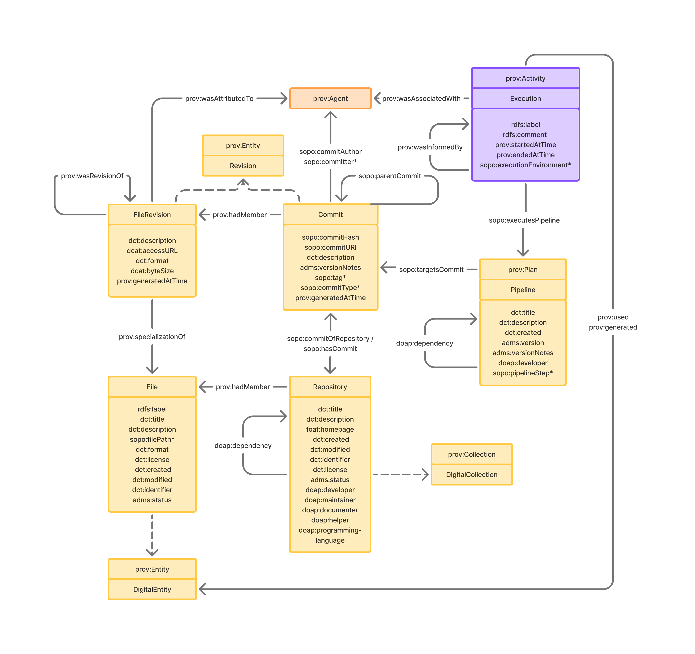

## The Software Provenance Ontology

The Software Provenance Ontology (soop) is a lightweight ontology that models versioned digital artifacts and their associated processes, such as commits, files, pipelines, and computational processes. It builds on established vocabularies such as PROV-O (W3C Provenance Ontology) and Dublin Core to support rich provenance tracking, reproducibility, and versioning in digital infrastructure, particularly in code and data science environments.

## Motivation

In software and data-intensive environments, tracking the evolution of digital content—such as files, repositories, pipelines, and execution traces—is essential for provenance, reproducibility, and collaboration. soop provides a conceptual framework for:

- Describing versioned digital artifacts (like commits, files, and content entities).
- Modeling computational processes (pipelines and activities).
- Linking entities across time, provenance, and usage contexts.
- Extending common standards like PROV-O and DC Terms for practical use in software and data workflows.

## Namespaces

The namespace prefixes used in this document are:

<div align="center">

| Prefix | Namespace URI                                           |
| ------ | ------------------------------------------------------- |
| `soop` | `https://w3id.org/soop/voc#`                            |
| `prov` | `http://www.w3.org/ns/prov#`                            |
| `dct`  | `http://purl.org/dc/terms/`                             |
| `pav`  | `http://purl.org/pav/`                                  |
| `foaf` | `http://xmlns.com/foaf/0.1/`                            |
| `xsd`  | `http://www.w3.org/2001/XMLSchema#`                     |
| `dcat` | `http://www.w3.org/ns/dcat#`                            |
| `rdf`  | `http://www.w3.org/1999/02/22-rdf-syntax-ns#`           |
| `rdfs` | `http://www.w3.org/2000/01/rdf-schema#`                 |
| `owl`  | `http://www.w3.org/2002/07/owl#`                        |

</div>

---

## Overview



---

## Classes

---

### `soop:DigitalCollection`

A curated aggregation of digital resources managed as a coherent group.

* **Subclass of**: `prov:Collection`
* **Superclass of**: `soop:Repository`
* **Usage note**: Represents collections such as code repositories, document sets, or datasets.

---

### `soop:Repository`

A code repository (e.g., a GitHub repository).

* **Subclass of**: `soop:DigitalCollection`

---

### `soop:Revision`

A versioned snapshot of content or state.

* **Subclass of**: `prov:Entity`
* **Superclass of**: `soop:Commit`, `soop:FileRevision`

---

### `soop:Commit`

An immutable state of a code repository, such as a Git commit or tag.

* **Subclass of**: `soop:Revision`

---

### `soop:DigitalEntity`

A digital object with a stable identity and possible versioning.

* **Subclass of**: `prov:Entity`
* **Superclass of**: `soop:File`
* **Usage note**: Includes structured or unstructured digital content like files, web resources and metadata.

---

### `soop:File`

A digital file that can be versioned.

* **Subclass of**: `soop:DigitalEntity`
* **Usage note**: Linked to the repository it's contained within with `prov:hadMember`, and to its revisions with `prov:specializationOf`.

--- 

### `soop:FileRevision`

A snapshot of a file at a specific point in time.

* **Subclass of**: `soop:Revision`

---

### `soop:Pipeline`

A structured sequence of computational steps or processes.

* **Subclass of**: `prov:Plan`
* **Usage note**: Defines a reusable set of operations for data analysis or transformation.

---

### `soop:Execution`

An instance of running a computational process.

* **Subclass of**: `prov:Activity`
* **Usage note**: May refer to the `Pipeline` executed and the data it operated on with `executesPipeline`.

---

## Properties

---

### `soop:targets`

**Object Property**

Links a plan to the resources it uses to implement the plan.

* **Domain**: `prov:Plan`
* **Range**: `rdfs:Resource`

---

### `soop:targetsCommit`

**Object Property**

Links a plan to the specific commit it targets.

* **Domain**: `soop:Plan`
* **Range**: `soop:Commit`
* **Subproperty of**: `soop:targets`

---

### `soop:hasExecutionScript`

**Object Property**

Links a pipeline to its execution script.

* **Domain**: `soop:Pipeline`
* **Range**: `soop:FileRevision`
* **Subproperty of**: `soop:targets`

---

### `soop:hasCommit`

**Object Property**

Links a repository to a commit that belongs to it.

* **Domain**: `soop:Repository`
* **Range**: `soop:Commit`
* **Subproperty of**: `dct:hasVersion`, `pav:hasVersion`, `prov:generalizationOf`
* **Inverse property**: `soop:commitOfRepository`
* **Usage note**: Lists the revisions maintained in a given repository.

---

### `soop:commitOfRepository`

**Object Property**

Links a commit back to its parent repository.

* **Domain**: `soop:Commit`
* **Range**: `soop:Repository`
* **Subproperty of**: `dct:isVersionOf`, `prov:specializationOf`
* **Usage note**: Inverse of `soop:hasCommit`; describes ownership.

---

### `soop:usedPlan`

**Object Property**

Indicates the plan used by an activity (via property chain).

* **Domain**: `prov:Activity`
* **Range**: `prov:Plan`
* **Property chain axiom**: `prov:qualifiedAssociation → prov:hadPlan`
* **Usage note**: Useful for indirectly identifying which plan a process followed.

---

### `soop:executes`

**Object Property**

The script, commit or other resource executed as part of a computational process.

* **Domain**: `soop:Execution`
* **Range**: `soop:Revision`
* **Property chain axiom**: `soop:usedPlan → soop:targets`

### `soop:usedPipeline`

**Object Property**

Indicates the specific pipeline executed by an `Execution`.

* **Domain**: `soop:Execution`
* **Range**: `soop:Pipeline`
* **Subproperty of**: `soop:usedPlan`
* **Usage note**: Connects runtime activity to its pipeline definition.

---

### `soop:parentCommit`

**Object Property**

Links a commit to its immediate predecessor.

* **Domain**: `soop:Commit`
* **Range**: `soop:Commit`
* **Subproperty of**: `pav:previousVersion`, `prov:wasRevisionOf`
* **Usage note**: Used to establish a commit history or version chain.

---

### `soop:commitURI`

**Datatype Property**

A web-accessible URI for a commit.

* **Domain**: `soop:Commit`
* **Range**: `xsd:anyURI`
* **Subproperty of**: `dcat:accessURL`, `foaf:page`
* **Usage note**: Enables navigation to external representations (e.g., GitHub URLs).

---

### `soop:commitHash`

**Datatype Property**

The cryptographic hash of a commit.

* **Domain**: `soop:Commit`
* **Range**: `xsd:string`
* **Subproperty of**: `dct:identifier`
* **Usage note**: Unique identifier for commits (e.g., Git SHA-1 hash).

---

### `soop:commitAuthor`

**Object Property**

The author of a commit.

* **Domain**: `soop:Commit`
* **Range**: `prov:Agent`
* **Subproperty of**: `prov:wasAttributedTo`
* **Usage note**: Captures attribution information from the version control system.

---

## Examples

```turtle
@prefix soop:   <https://w3id.org/soop/voc#> .
@prefix prov:   <http://www.w3.org/ns/prov#> .
@prefix dct:    <http://purl.org/dc/terms/> .
@prefix pav:    <http://purl.org/pav/> .
@prefix foaf:   <http://xmlns.com/foaf/0.1/> .
@prefix dcat:   <http://www.w3.org/ns/dcat#> .
@prefix xsd:    <http://www.w3.org/2001/XMLSchema#> .
@prefix ex:     <http://example.org/> .

# Repository holding point cloud processing code
ex:ExampleRepo a soop:Repository ;
    dct:title "Point Cloud Processing Repository" ;
    dcat:accessURL <https://github.com/example/pointcloud-processing> ;
    soop:hasCommit ex:commitPCProcessingV1 .

# Commit representing specific version of processing code
ex:PCProcessingV1 a soop:Commit ;
    soop:commitHash "def456ghi789" ;
    soop:commitURI <https://github.com/example/pointcloud-processing/commit/def456ghi789> ;
    dct:description "Initial commit with scripts to process pointcloud data" ;
    soop:commitAuthor ex:person1 ;
    prov:generatedAtTime "2025-08-15T11:00:00Z"^^xsd:dateTime .

# The engineer who wrote the code
ex:person1 a prov:Person ;
    foaf:name "Person 1" ;
    foaf:mbox <mailto:person1@example.org> .

# Pipeline defining the point cloud processing steps linked to the commit
ex:pcProcessingPipeline a soop:Pipeline ;
    dct:title "Point Cloud Cleaning and Filtering Pipeline" ;
    dct:description "Pipeline to clean, filter, and reduce noise in raw point cloud scans" ;
    soop:targetsCommit ex:commitPCProcessingV1 .

# External datasets for raw and processed point cloud data
ex:rawPointCloudData a prov:Entity ;
    dct:title "Raw Point Cloud Scan Data" ;
    dcat:accessURL <https://storage.example.org/data/pointcloud/raw_scan.las> ;
    dct:description "Raw LiDAR scan point cloud data captured from site A" .

ex:processedPointCloudData a prov:Entity ;
    dct:title "Processed Point Cloud Data" ;
    dcat:accessURL <https://storage.example.org/data/pointcloud/processed_scan.png> ;
    dct:description "Processed point cloud data" .

# Execution process
ex:pcProcessingRun20250820 a soop:Execution ;
    dct:title "Point Cloud Processing Run August 20, 2025" ;
    prov:startedAtTime "2025-08-20T09:00:00Z"^^xsd:dateTime ;
    prov:endedAtTime "2025-08-20T09:45:00Z"^^xsd:dateTime ;
    soop:executedPipeline ex:pcProcessingPipeline ;
    prov:used ex:rawPointCloudData ;
    prov:generated ex:processedPointCloudData ;
    prov:wasAssociatedWith ex:person1 .

```


